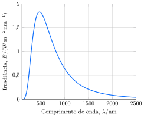

Considere o espectro de emissão da radiação solar.

**Assinale** a alternativa que mais se aproxima da temperatura do sol.

- [ ] $\pu{3 kK}$
- [ ] $\pu{4 kK}$
- [ ] $\pu{5 kK}$
- [x] $\pu{6 kK}$
- [ ] $\pu{7 kK}$
