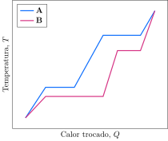

Amostras de massas iguais de duas substâncias, **A** e **B**, foram submetidas independentemente a um processo de aquecimento em atmosfera inerte e sob pressão constante. A curva de aquecimento das amostras é apresentado a seguir.

**Assinale** a alternativa *incorreta*.

- [ ] A entalpia de fusão de **A** é menor que a de **B**.
- [x] A entalpia de vaporização de **A** é menor que a de **B**.
- [ ] A capacidade calorífica na fase sólida de **A** é menor que na de **B**.
- [ ] A capacidade calorífica na fase líquida de **A** é maior que na de **B**.
- [ ] A capacidade calorífica na fase gasosa de **A** é maior que na de **B**.