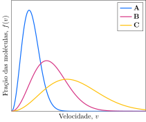

Considere a distribuição de velocidades dos gases **A**, **B** e **C**.

**Assinale** a alternativa com a identidade de **A**, **B** e **C**, respectivamente.

- [ ] $\ce{He, Ne, Ar}$
- [ ] $\ce{He, Ar, Ne}$
- [ ] $\ce{Ne, He, Ar}$
- [ ] $\ce{Ar, He, Ne}$
- [x] $\ce{Ar, Ne, He}$
