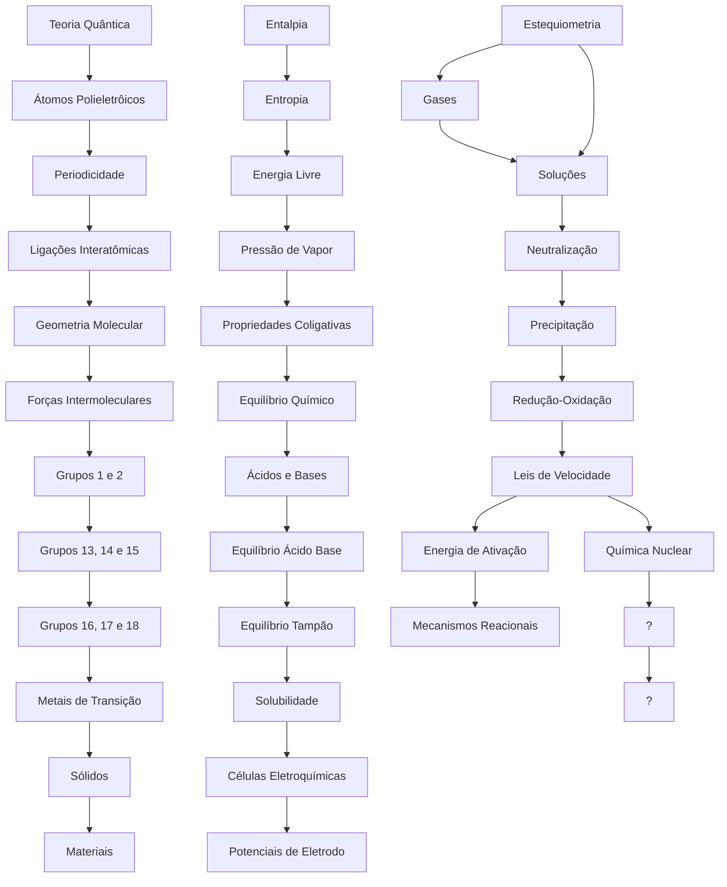

  

# Banco de Questões

Esse repositório contém questões de química em nível médio, utilizadas na preparação de alunos das turmas IME-ITA do colégio e curso Pensi.

## Dados Termodinâmicos

Os dados termodinâmicos estão disponíveis [nesta planilha](https://docs.google.com/spreadsheets/d/1lNYtEriCuBZ2hztBSJu8akMtKyZMWEe4iaoBbXvlnc4/edit?usp=sharing) para consulta.

## Fluxograma

