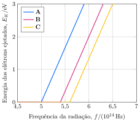

Considere os dados obtidos em um experimento de efeito fotoelétrico com três metais, **A**, **B**, e **C**.

-  **Determine** a função trabalho dos metais **A**, **B**, e **C**.
-  **Determine** o valor da constante de Planck.

---

- $\pu{2,48 eV}$, $\pu{2,25 eV}$, $\pu{2,3 eV}$
- $\pu{6,62e-34 J.s}$

