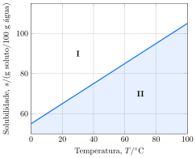

Considere as curvas de solubilidade do brometo de potássio em água.

**Assinale** a alternativa *incorreta*.

- [ ] A dissolução do $\ce{KBr}$ em água é um processo endotérmico.   
- [x] A $\pu{30 \degree C}$, a concentração de uma solução aquosa saturada em $\ce{KBr}$ é de aproximadamente $\pu{6 mol.kg-1}$.   
- [ ] Misturas correspondentes a pontos situados na região $\text{\textbf{I}}$ da figura são bifásicas.   
- [ ] Misturas correspondentes a pontos situados na região $\text{\textbf{II}}$ da figura são monofásicas.   
- [ ] Misturas correspondentes a pontos situados sobre a curva são saturadas em $\ce{KBr}$.   
