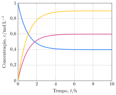

As concentrações dos reagentes e produtos de uma reação foram monitoradas ao longo do tempo.

**Assinale** a alternativa que mais se aproxima da constante de equilíbrio dessa reação balanceada com os menores coeficientes inteiros.

- [ ] $\pu{1,35}$
- [x] $\pu{1,64}$
- [ ] $\pu{1,86}$
- [ ] $\pu{2,03}$
- [ ] $\pu{2,35}$
