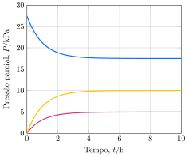

As pressões parciais dos reagentes e produtos de uma reação foram monitoradas ao longo do tempo.

**Assinale** a alternativa que mais se aproxima da constante de equilíbrio dessa reação balanceada com os menores coeficientes inteiros.

- [x] $\pu{0,016}$
- [ ] $\pu{0,29}$
- [ ] $\pu{0,46}$
- [ ] $\pu{1,6}$
- [ ] $\pu{29}$
