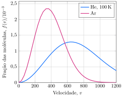

Considere a distribuição de velocidades de uma amostra de hélio a $\pu{100 K}$ e uma amostra de argônio.

**Assinale** a alternativa que mais se aproxima da temperatura da amostra de argônio.

- [ ] $\pu{100 K}$
- [ ] $\pu{200 K}$
- [x] $\pu{300 K}$
- [ ] $\pu{400 K}$
- [ ] $\pu{500 K}$
