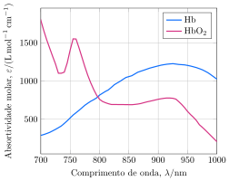

A saturação de oxigênio, definida como a razão entre a concentração de oxi-hemoglobina e a concentração total de hemoglobina no sangue, pode ser determinada por espectroscopia de absorção. Uma amostra de sangue é coletada e colocada em uma célula com $\pu{10 mm}$ de caminho óptico.  

A solução transmite $10\%$ da luz incidente de comprimento de onda $\pu{750 nm}$ e $30\%$ da luz incidente de comprimento de onda $\pu{850 nm}$.

- **Determine** concentração de oxi-hemoglobina e desoxi-hemoglobina no sangue.
- **Determine** a saturação do sangue.

---  
- $\pu{7 mmol/L}$ e $\pu{0,4 mmol/L}$
- $95\%$
