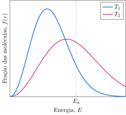

Considere a distribuição de velocidades para os reagentes de uma reação em duas temperaturas.

 
Considere as proposições.

1. [ ] A constante de equilíbrio da reação é igual em $T_1$ e em $T_2$.
2. [x] A velocidade da reação é menor em $T_1$ do que em $T2$. 
3. [ ] A constante de velocidade da reação é igual em $T_1$ e em $T_2$.
4. [x] Em $T_1$, há menos moléculas com energia suficiente para a reação do que em $T_2$.

**Assinale** a alternativa que relaciona as proposições *corretas*.