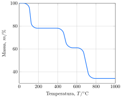

Uma amostra de um sal de cálcio foi submetiva à análise termogravimétrica.

**Assinale** a alternativa que representa a identidade do sal analisado.

- [ ] $\ce{CaC2O4.H2O}$
- [x] $\ce{CaC2O4.2H2O}$
- [ ] $\ce{CaCO3.H2O}$
- [ ] $\ce{CaCO3}$
- [ ] $\ce{Ca(C2H3O2)2}$