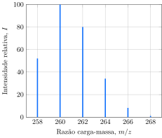

A análise de uma amostra de algas marinhas revelou, por cromatografia gasosa, a bioacumulação de um poluente $\ce{\textbf{A}}$. O espectro de massa do composto orgânico $\ce{\textbf{A}}$ é representado abaixo. Os picos relativos aos isótopos contendo carbono-13 foram omitidos por simplicidade. 

Cinco fórmulas moleculares foram propostas para $\ce{\textbf{A}}$, com base nos poluentes encontrados em um efluente industrial próximo. Assinale a alternativa que corresponde à única fórmula molecular possível, entre as apresentadas, para $\ce{\textbf{A}}$.

- [x] $\ce{C4Cl6}$
- [ ] $\ce{C6HClN4O6}$
- [ ] $\ce{C7H11Cl2O4P}$
- [ ] $\ce{C8H6Br2}$
- [ ] $\ce{C15H16O2S}$
