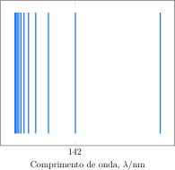

---
answer:
    - $Z = 4$, $\ce{Be^{3+}}$
    - $\pu{208 nm}$
---

Considere parte do espectro de emissão para um íon monoeletrônico em fase gasosa. Todas as linhas resultam de transições eletrônicas para o segundo estado excitado.

a. **Determine** o número atômico do íon monoeletrônico.
b. **Determine** o comprimento de onda para a linha de menor energia.

---

Segundo estado excitado: $n_{1}=3\;n_{2}=\text{variável}$ 
Cálculo do número atômico:
$$\frac{1}{\lambda}=Z^{2}R( \frac{1}{n_{1}^{2}}- \frac{1}{n_{2}^{2}})$$
No gráfico nós temos a primeira faixa que representa $n_{2}=4$ Depois temos a segunda faixa que representa $n_{2}=5$ cujo comprimento de onda é dado, portanto:
$$\frac{1}{142\cdot10^{-9}}=Z^{2}\cdot1,1\cdot10^{7}( \frac{1}{3^{2}}- \frac{1}{5^{2}})$$
$$Z^{2}=9$$
$$\boxed{Z=3}$$
$$\boxed{Li^{2+}}$$
Para a linha de menor energia, basta maximizar $n_{2}$ ou seja $n_{2}=4$
Cálculo do comprimento de onda:
$$\frac{1}{\lambda}=3^{2}\cdot1,1\cdot10^{7}( \frac{1}{3^{2}}- \frac{1}{4^{2}})$$
$$\lambda=\boxed{207,8\;nm}$$