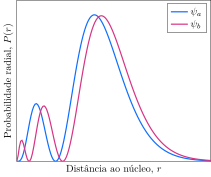

Considere a função de distribuição radial para dois orbitais do átomo de hidrogênio.

**Assinale** a alternativa *correta*.

- [x] $\psi_a$ e $\psi_b$ podem ser o $3p$ e $3s$, respectivamente.
- [ ] $\psi_a$ e $\psi_b$ podem ser o $3p$ e $4p$, respectivamente.
- [ ] $\psi_a$ e $\psi_b$ podem ser o $4p$ e $4d$, respectivamente.
- [ ] $\psi_b$ possui menor penetrabilidade que o orbital $\psi_a$.
- [ ] $\psi_a$ é mais energético que $\psi_b$.
