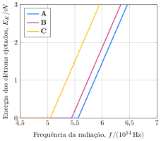

Os dados a seguir foram obtidos em um experimento de efeito fotoelétrico utilizando os metais rubídio, potássio e sódio.

**Assinale** a alternativa com a identidade de **A**, **B** e **C**, respectivamente.

- [x] $\ce{Na, K, Rb}$
- [ ] $\ce{Na, Rb, K}$
- [ ] $\ce{K, Na, Rb}$
- [ ] $\ce{Rb, Na, K}$
- [ ] $\ce{Rb, K, Na}$
