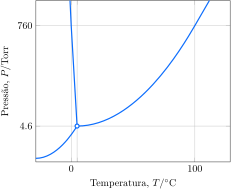

Considere as condições para uma amostra de água: $\pu{1 atm}$, $\pu{200 \degree C}$; $\pu{100 atm}$, $\pu{50 \degree C}$; $\pu{3 Torr}$, $\pu{10 \degree C}$; $\pu{20 Torr}$, $\pu{-10 \degree C}$.

**Assinale** a alternativa com o estado de uma amostra de água em cada condição, respectivamente.

- [x] vapor; líquido; vapor; sólido

---

Ponto 1: $1\,atm\;\;\pu{200 \degree C}\rightarrow 760\,tor\;\;\pu{200 \degree C}\rightarrow \text{vapor}$

Ponto 2: $100\,atm\;\;\pu{50 \degree C}\rightarrow 76000\,tor\;\;\pu{50 \degree C}\rightarrow \text{líquido}$

Ponto 3: $3\,tor\;\;\pu{10 \degree C}\rightarrow \text{vapor}$

Ponto 4: $20\,tor\;\;-\pu{10 \degree C}\rightarrow \text{sólido}$

