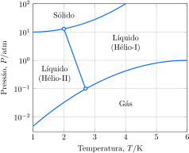

Considere diagrama de fases do hélio:

e as seguintes proposições.

1. [x] A temperatura máxima na qual o superfluido hélio-II pode existir é cerca de $\pu{2,7 K}$.
2. [x] A pressão mínima na qual o hélio sólido pode existir é cerca de $\pu{10 atm}$.
3. [x] O ponto de ebulição normal do hélio-I é cerca de $\pu{6 K}$.
4. [ ] O hélio sólido pode sublimar. 

**Assinale** a alternativa que relaciona as proposições *corretas*.
