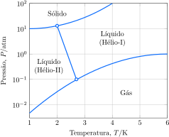

Considere diagrama de fases do hélio:

e as seguintes proposições.

1. [x] A temperatura máxima na qual o superfluido hélio-II pode existir é cerca de $\pu{2,7 K}$.
2. [x] A pressão mínima na qual o hélio sólido pode existir é cerca de $\pu{10 atm}$.
3. [x] O líquido hélio-I é mais denso que o hélio-II.
4. [ ] O hélio sólido pode sublimar. 

**Assinale** a alternativa que relaciona as proposições *corretas*.

---

1. **Correta**. Basta observar o ponto de equilíbrio de fases existente à pressão de $10^{-1}\,atm$ que ocorre a uma temperatura aproximadamente igual a $2,7\,K$
2. **Correta**. A curva de equilíbrio entre o estado sólido e líquido tangencia a pressão de $10^{1}\,atm$ 
3. **Correta**. Para verificar densidade basta fazer a seguinte relação:
$$\underbrace{\frac{\Delta P}{\Delta T}}_{\text{coeficiente angular}}= \frac{\Delta S}{\Delta V}$$
Olhando para a curva que divide os dois líquidos, vemos que ela é decrescente, então seu coeficiente angular será negativo, portanto:
$$\frac{\Delta S}{\Delta V}<0\therefore \frac{S_{II}-S_{I}}{V_{II}-V_{I}}<0$$
Como o líquido I existe a uma maior temperatura, naturalmente ele irá possuir maior entropia, portanto $S_{II}-S_{I}<0$ , portanto:
$$V_{II}-V_{I}>0\therefore V_{II}>V_{I}$$
$$ \frac{1}{V_{II}}< \frac{1}{V_{I}}\therefore \frac{m}{V_{II}}< \frac{m}{V_{I}}\therefore \mu_{II}<\mu_I$$
4. **Incorreta**. Não existe interseção entre a curva de equilíbrio líquido-sólido com a de equilíbrio líquido-gasoso
