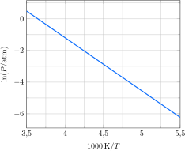

---
answer:
    - $\pu{28 kJ.mol-1}$
    - $\pu{100 J.K-1.mol-1}$
    - $\pu{270 K}$
    - $\pu{210 K}$
---

A pressão de vapor do cloreto-difluoreto de fosforila, $\ce{OPClF2}$, foi medida em função da temperatura.

a. **Determine** a entalpia padrão de vaporização do $\ce{OPClF2}$.
b. **Determine** a entropia padrão de vaporização do $\ce{OPClF2}$.
c. **Determine** o ponto de ebulição normal do $\ce{OPClF2}$.
d. **Determine** o ponto de ebulição do $\ce{OPClF2}$ em $\pu{15 Torr}$.

