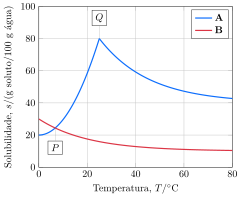

Considere as curvas de solubilidade.

Considere as proposições:
 
1. [ ] Soluções preparadas com $\pu{40 g}$ de $\ce{Na2SO4}$ ou com $\pu{40 g}$ de $\ce{SO2}$ em $\pu{100 g}$ de água em são instáveis em $\pu{60 \degree C}$.
2. [ ] Soluções preparadas com $\pu{40 g}$ de $\ce{Na2SO4}$ em $\pu{50 g}$ de água em são supersaturadas em $\pu{25 \degree C}$.
3. [x] A curva de solubilidade do $\ce{Na2SO4}$ indica uma mudança na estrutura do corpo de fundo a partir de $\pu{25 \degree C}$.
4. [x] A solubilidade do $\ce{SO2}$ segue o perfil esperado para a solubilidade de gases em água.   

**Assinale** a alternativa que relaciona as proposições *corretas*.

