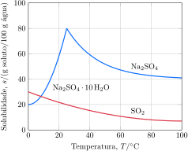

Considere as curvas de solubilidade de duas substâncias $\ce{A}$ e $\ce{B}$.

**Assinale** a alternativa *correta*.

- [ ] No ponto $P$ as soluções apresentam a mesma temperatura mas as solubilidades de $\ce{A}$ e $\ce{B}$ são diferentes.   
- [ ] A solução da substância $\ce{B}$ está supersaturada no ponto $Q$.    
- [ ] Soluções preparadas com $\pu{40 g}$ de $\ce{A}$ ou $\ce{B}$ em $\pu{100 g}$ de água são instáveis.
- [ ] As curvas de solubilidade não indicam mudanças na estrutura dos solutos.   
- [x] A solubilidade da substância $\ce{B}$ segue o perfil esperado para a solubilidade de gases em água.   

