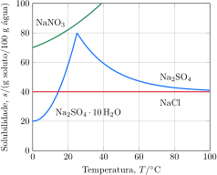

Considere as curvas de solubilidade.

Considere as proposições.
 
1. [ ] Em $\pu{25 \degree C}$, uma mistura de $\pu{120 g}$ de $\ce{NaNO3}$ com $\ce{100 g}$ água é bifásica, sendo uma das fases o nitrato de amônio sólido e a outra a água líquida.   
2. [x] Em $\pu{0 \degree C}$, uma mistura de $\pu{20 g}$ de $\ce{NaCl}$ com $\pu{100 g}$ de água é monofásica, sendo esta fase uma solução aquosa não saturada em $\ce{NaCl}$.   
3. [x] Em $\pu{25 \degree C}$, a concentração de íons de sódio existentes na fase líquida de uma mistura preparada pela adição de $\pu{6 g}$ de $\ce{NaCl}$ à $\pu{100 g}$ de água é $\pu{1 mol.L-1}$.   
4. [x] Em $\pu{25 \degree C}$, a quantidade de íons de sódio presentes em uma solução preparada pela dissolução de $\pu{1 g}$ de $\ce{Na2SO4}$ em $\ce{10 g}$ de água é maior do que a existente em outra solução preparada pela dissolução de $\pu{1 g}$ de $\ce{Na2SO4.10H2O}$ na mesma quantidade de água.  

**Assinale** a alternativa que relacionas as proposições *corretas*.
