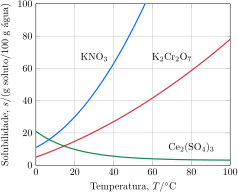

Considere as curvas de solubilidade.

Considere as proposições.

1. [ ] Ao dissolver $\pu{130 g}$ de $\ce{KNO3}$ em $\pu{200 g}$ de água, a $\pu{40 \degree C}$, a solução obtida é saturada e possui $\pu{70 g}$ de corpo de fundo.
2. [x] Ao dissolver $\pu{20 g}$ de $\ce{Ce2(SO4)3}$ em $\pu{300 g}$ de água a $\pu{10 \degree C}$ e, posteriormente, aquecer a solução até $\pu{90 \degree C}$ haverá gradativa precipitação da substância.
3. [ ] A menor quantidade de água necessária para dissolver completamente $\pu{140 g}$ de $\ce{K2Cr2O7}$ a $\pu{90 \degree C}$ é cerca de $\pu{150 g}$.
4. [ ] O nitrato de sódio é a substância mais solúvel a $\pu{100 \degree C}$.

**Assinale** a alternativa que relaciona as proposições *corretas*.

