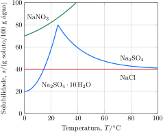

Considere a curvas de solubilidade do $\ce{Na2SO4}$.

Considere as proposições.

1. [x] A entalpia de solução do $\ce{Na2SO4.10H2O}$ é endotérmica, enquanto a do $\ce{Na2SO4}$ é exotérmica.
2. [x] A hidratação de $\pu{1 mol}$ de $\ce{Na2SO4}$ libera a mesma energia que a hidratação de $\pu{1 mol}$ de $\ce{Na2SO4.10H2O}$.
3. [x] A hidratação de $\pu{1 g}$ de $\ce{Na2SO4}$ libera mais energia que a hidratação de $\pu{1 g}$ de $\ce{Na2SO4.10H2O}$.
4. [x] A entalpia de rede do $\ce{Na2SO4.10H2O}$ é maior que a do $\ce{Na2SO4}$.

**Assinale** a alternativa que relacionas as proposições *corretas*.
