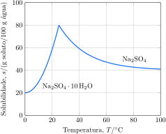

Considere as curvas de solubilidade.

Considere as proposições.

1. [x] A hidratação do $\ce{Na2SO4}$ libera mais energia que a hidratação do $\ce{Na2SO4.10H2O}$.
2. [x] A entalpia de solução do $\ce{Na2SO4.10H2O}$ é endotérmica, enquanto a do $\ce{Na2SO4}$ é exotérmica.
3. [ ] A entalpia de dissociação do $\ce{Na2SO4}$ é maior que a do $\ce{Na2SO4.10H2O}$.
4. [x] O valor absoluto da entalpia de dissociação do $\ce{NaNO3}$ é maior que o do $\ce{NaCl}$. 

**Assinale** a alternativa que relacionas as proposições *corretas*.
