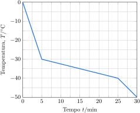

---
data:
    - kf(CCl4)
    - Tfus(CCl4)
answer:
    - $66\%$
    - $\pu{0,2 mol.L-1}$
    - $\pu{0,2 mmol.L-1}$
---

Em solução de tetracloreto de carbono, o tetracloreto de vanádio sofre dimerização formando $\ce{V2Cl8}$. Em um experimento, $\pu{6,76 g}$ de $\ce{VCl4}$ foram dissolvidos em $\pu{100 g}$ de tetracloreto de carbono a $\pu{0 \degree C}$. Após certo tempo a mistura alcançou o equilíbrio, sendo a densidade $\pu{1,78 g.cm-3}$. A mistura foi resfriada com nitrogênio líquido, sendo registrada a variação da temperatura com o tempo.

  

a. **Determine** o grau de dimerização do tetracloreto de vanádio.
b. **Determine** a concentração molar de $\ce{VCl4}$ no equilíbrio.
c. **Determine** a concentração molar de $\ce{V2Cl8}$ no equilíbrio.

