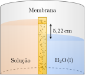

---
answer:
    - $\pu{4800 g.mol-1}$
    - $\pu{-4e-4 \degree C}$
    - A mudança no ponto de congelamento é tão pequena, que não pode ser medida com precisão; a pressão osmótica é o método mais adequado.
---

Uma solução de $\pu{0,01 g}$ de uma proteína em $\pu{10 mL}$ de água em $\pu{20 \degree C}$ tem elevação de $\pu{5,22 cm}$ no aparelho:

A densidade da solução é $\pu{1 g.cm-1}$.

a. **Determine** a massa molar da proteína.
b. **Determine** o ponto de congelamento da solução.
c. **Explique** qual propriedades coligativa, pressão osmótica ou diminuição no ponto de congelamento, é melhor para medir a massa molar de macromoléculas.