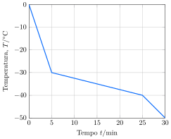

---
data:
- kf(CCl4)
- Pf(CCl4)
---

Em solução de tetracloreto de carbono, o tetracloreto de vanádio sofre dimerização formando $\ce{V2Cl8}$. Em um experimento, $\pu{6,76 g}$ de $\ce{VCl4}$ foram dissolvidos em $\pu{100 g}$ de tetracloreto de carbono a $\pu{0 \degree C}$. Após certo tempo a mistura alcançou o equilíbrio, sendo a densidade $\pu{1,78 g.cm-3}$.  A mistura foi resfriada com nitrogênio líquido, sendo registrada a variação da temperatura com o tempo.

  

- **Determine** o grau de dimerização do tetracloreto de vanádio.
- **Determine** a concentração de $\ce{VCl4}$ e $\ce{V2Cl8}$ no equilíbrio.

---

- $85\%$
- $\pu{84 mmol.L-1}$ e $\pu{234 mmol.L-1}$
