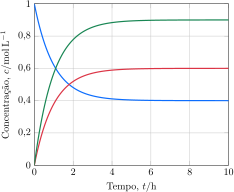

---
answer:
    - $\pu{1,64}$
---

As concentrações dos reagentes e produtos de uma reação foram monitoradas ao longo do tempo.

**Determine** a constante de equilíbrio da reação balanceada com os menores coeficientes inteiros.

