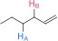
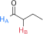

Considere os compostos.

1. [ ] 
2. [x] 
3. [x] 
4. [ ] 

**Assinale** a alternativa que relaciona os compostos em que o hidrogênio $\color{blue}\ce{H_A}$ é mais ácido que o hidrogênio $\color{red}\ce{H_B}$.
