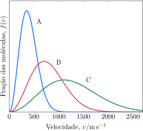

Considere a distribuição de velocidade dos gases $\ce{He}$, $\ce{Ne}$ e $\ce{Ar}$.

**Assinale** a alternativa com os gases $\ce{A}$, $\ce{B}$, $\ce{C}$, respectivamente.

- [x] $\ce{Ar}$; $\ce{Ne}$; $\ce{He}$

