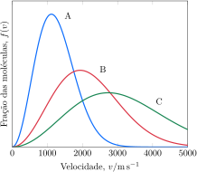

Considere a distribuição de velocidade de três amostras de hélio em $\pu{300 K}$, $\ce{900 K}$ e $\ce{1800 K}$.

**Assinale** a alternativa com a temperatura das amostras $\ce{A}$, $\ce{B}$, $\ce{C}$, respectivamente.

- [x] $\pu{300 K}$; $\ce{900 K}$; $\ce{1800 K}$

