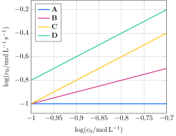

Considere quatro séries de experimentos em que quatro espécies químicas reagem entre si, à pressão e temperatura constantes:

$$
\ce{\textbf{A}(aq) + \textbf{B}(aq) + \textbf{C}(aq) + \textbf{D}(aq) -> produtos}
$$

Em cada série, fixam-se as concentrações de três espécies e varia-se a concentração, $c_0$, da quarta. Para cada série, determina-se a velocidade inicial da reação, $v_0$, em cada experimento. Os resultados de cada série são apresentados a seguir.

**Assinale** a alternativa com a ordem global da reação.
 
- [ ] 3    
- [ ] 4    
- [x] 5    
- [ ] 6    
- [ ] 7 
