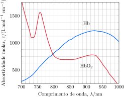

---
answer:
    - $\pu{7 mmol.L-1}$ e $\pu{0,4 mmol.L-1}$
    - $\pu{95}\%$
---

A saturação de oxigênio, definida como a razão entre a concentração de oxi-hemoglobina e a concentração total de hemoglobina no sangue, pode ser determinada por espectroscopia de absorção. Uma amostra de sangue é coletada e colocada em uma célula com $\pu{10 mm}$ de caminho óptico.  

A solução transmite $10\%$ da luz incidente de comprimento de onda $\pu{750 nm}$ e $\pu{30}\%$ da luz incidente de comprimento de onda $\pu{850 nm}$.

a. **Determine** concentração de oxi-hemoglobina e desoxi-hemoglobina no sangue.
b. **Determine** a saturação de oxigênio na amostra de sangue.
