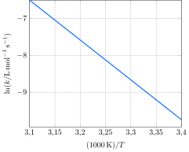

A constante de velocidade da reação de segunda ordem entre bromo-etano e íons hidróxido em água  formando etanol foi medida em várias temperaturas, com os seguintes resultados:

**Assinale** a alternativa que mais se aproxima da energia de ativação para essa reação.

- [ ] $\pu{50 kJ.mol-1}$
- [ ] $\pu{60 kJ.mol-1}$
- [ ] $\pu{70 kJ.mol-1}$
- [ ] $\pu{80 kJ.mol-1}$
- [x] $\pu{90 kJ.mol-1}$
