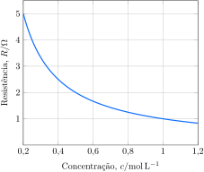

Uma série de soluções aquosas de $\ce{NaCl}$ foram preparadas por diluições sucessivas de uma amostra e colocadas em uma célula de $\pu{0,13 cm}$ de comprimento e $\pu{1 cm2}$ de área transversal. A resistência da célula foi medida em função da concentração da solução.

**Determine** a condutividade molar do $\ce{NaCl}$.

---

Tomando o ponto (1;1) do gráfico, vamos fazer nossos cálculos 
Cálculo da condutividade a partir da lei de Ohm:
$$R=\frac{L}{A\kappa}$$
$$\pu{1 \Omega}=\frac{\pu{0,13e-2 m}}{\pu{(e-4m2)}\kappa }$$
$$\kappa=\pu{13 S.m-1}$$
Cálculo da condutividade molar:

$$\Lambda_{m}=\frac{\kappa}{c}$$
$$\Lambda_{m}=\frac{\pu{13 S.m-1}}{\pu{1 M}}=\boxed{\pu{13 S.m-1.M-1}}$$
Tome o ponto (0,2 ; 5) e veja que a resposta será a mesma
