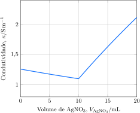

---
answer:
    - $\ce{ Ag^+(aq) + Cl^-(aq) -> AgCl(s) }$
    - Antes do ponto de equivalência, $\ce{Na^+}$, $\ce{Cl^-}$ e $\ce{NO3^-}$. No ponto de equivalência, $\ce{Na^+}$ e $\ce{NO3^-}$. Após o ponto de equivalência, $\ce{Na^+}$, $\ce{Ag^+}$ e $\ce{NO3^-}$. 
---

Uma alíquota de uma solução $\pu{0,1 mol.L-1}$ de cloreto de sódio, $\ce{NaCl}$, foi titulada com uma solução $\pu{1 mol.L-1}$ de nitrato de prata, $\ce{AgNO3}$. A condutividade da solução foi monitorada ao longo da reação.

a. **Apresente** a equação iônica para a reação de titulação.
b. **Determine** o volume de nitrato de prata necessário para atingir o ponto de equivalência.
c. **Identifique** os íons responsáveis pela condutividade da solução ao longo da titulação.
