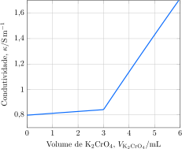

---
answer:
    - $\ce{ 2 Ag^+(aq) + Cr2O4^{2+}(aq) -> Ag2CrO4(s) }$
    - $\pu{0,06 mol.L-1}$
---

Uma alíquota de $\pu{100 mL}$ de uma solução de nitrato de prata, $\ce{AgNO3}$, foi titulada com uma solução $\pu{1 mol.L-1}$ de cromato de potássio, $\ce{K2CrO4}$. A condutividade da solução foi monitorada ao longo da reação.

a. **Apresente** a equação iônica para a reação de titulação.
b. **Determine** a concentração da solução de nitrato de prata.
