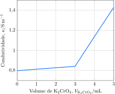

---
answer:
    - $\ce{ 2 Ag^+(aq) + Cr2O4^{2+}(aq) -> Ag2CrO4(s) }$
    - $\pu{0,06 mol.L-1}$
---

Uma alíquota de $\pu{100 mL}$ de uma solução de nitrato de prata, $\ce{AgNO3}$, foi titulada com uma solução $\pu{1 mol.L-1}$ de cromato de potássio, $\ce{K2CrO4}$. A condutividade da solução foi monitorada ao longo da reação.

a. **Apresente** a equação iônica para a reação de titulação.
b. **Determine** a concentração da solução de nitrato de prata.

---

Analisando os íons presentes em solução, vemos que o precipitado será $\ce{Ag2CrO4}$ , com base nisso podemos escrever a equação iônica:
$$\boxed{\ce{2Ag+(aq) + CrO4^{2-}(aq)->Ag2CrO4(s)}}$$
Para descobrir a concentração da solução basta olhar para o ponto de equivalência, nesse ponto toda a prata foi titulada, então a reação ocorre estequiometricamente:
$$\frac{n_{\ce{Ag+}}}{2}=\frac{n_{\ce{CrO4^{2-}}}}{1}$$
Veja que no ponto de equivalência o volume da solução utilizado é de 3mL então podemos escrever:
$$\frac{(c_{\ce{Ag^{+}}})(\pu{100 mL})}{2}=\frac{(\pu{1 mol.L-1})(\pu{3 mL})}{1}$$
$$c_{\ce{Ag+}}=\boxed{c_{\ce{AgNO3}}=\pu{0,06 mol.L-1}}$$

