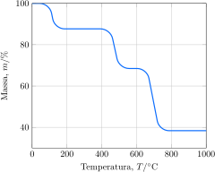

Uma amostra de oxalato de cálcio monoidratado foi submetida à análise termogravimétrica.

Considere as proposições.

1. [x] A água de hidratação é eliminada em $\pu{100 \degree C}$. 
2. [x] Ocorre liberação de $\ce{CO}$ em $\pu{500 \degree C}$ e $\ce{CO2}$ em $\pu{700 \degree C}$.
3. [x] A fase sólida é composta majoritariamente por $\ce{CaCO3}$ em $\pu{580 \degree C}$ e $\ce{CaO}$ em $\pu{900 \degree C}$.
4. [ ] $40\%$ da massa inicial é perdida na forma de gases.   

**Assinale** a alternativa que relacionas as proposições *corretas*
