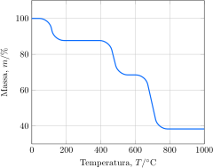

Uma amostra oxalato de cálcio monohidratado foi submetida à análise termogravimétrica.

**Assinale** a alternativa *incorreta*.

- [ ] A decomposição térmica do oxalato de cálcio ocorre em três etapas.   
- [ ] A água de hidratação é eliminada da estrutura cristalina do oxalato de cálcio a temperatura maior que $\pu{100 \degree C}$. 
- [ ] A decomposição do oxalato de cálcio ocorre com formação de monóxido e de dióxido de carbono.   
- [ ] O evento térmico que ocorre a a $\pu{800 \degree C}$ leva à formação de cal virgem.   
- [x] Na decomposição do oxalato de cálcio, praticamente $40\%$ da amostra é perdida na forma de gases.   
