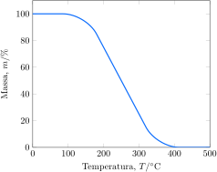

Uma amostra de uma substância desconhecida foi submetida à análise termogravimétrica.

**Assinale** a alternativa com uma possível substância.

- [x] $\ce{CO(NH2)2}$
- [ ] $\ce{FeSO4}$
- [ ] $\ce{Ca(NO3)2}$
- [ ] $\ce{Ag2CO3}$
- [ ] $\ce{NaHCO3}$

---

Na análise termogravimétrica de metais, temos que o produto final após o aquecimento será o óxido do metal, ou o metal puro caso seja um metal nobre, porém ao analisarmos o gráfico da questão vemos que após o aquecimento, **toda** a massa do composto é perdida na forma de gases, então basta encontrar nas opções uma substância que não seja formada por nenhum metal, isso encaixa com o item a $\ce{CO(NH2)2}$ também conhecido como **ureia** 

