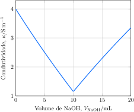

---
answer:
    - $\ce{ H3O^+(aq) + OH^-(aq) -> 2 H2O(l) }$
    - $\pu{10 mL}$
    - Antes do ponto de equivalência, $\ce{Na^+}$, $\ce{Cl^-}$ e $\ce{H^+}$. No ponto de equivalência, $\ce{Na^+}$ e $\ce{Cl^-}$. Após o ponto de equivalência, $\ce{Na^+}$, $\ce{H3O^+}$ e $\ce{Cl^-}$. 
---

Uma alíquota de uma solução $\pu{0,1 mol.L-1}$ de ácido clorídrico foi titulada com uma solução $\pu{1 mol.L-1}$ de hidróxido de sódio, $\ce{NaOH}$. A condutividade da solução foi monitorada ao longo da reação.

a. **Apresente** a equação iônica para a reação de titulação.
b. **Determine** o volume de hidróxido de sódio necessário para atingir o ponto de equivalência.
c. **Identifique** os íons responsáveis pela condutividade da solução ao longo da titulação.
d. **Explique** porque a condutividade da solução é maior após a adição de $\ce{5 mL}$ de base do que após a adição de $\pu{15 mL}$ de base.

