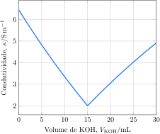

---
answer:
    - $\ce{ H3O^+(aq) + OH^-(aq) -> 2 H2O(l) }$
    - $\pu{75 mmol.L-1}$
---

Uma alíquota de $\pu{100 mL}$ de uma solução de ácido sulfúrico foi titulada com uma solução $\pu{1 mol.L-1}$ de hidróxido de potássio, $\ce{KOH}$. A condutividade da solução foi monitorada ao longo da reação.

a. **Apresente** a equação iônica para a reação de titulação.
b. **Determine** a concentração da solução de ácido sulfúrico.
