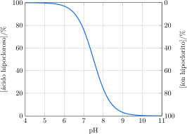

O cloro comercial é comumente usado na maioria das piscinas com o objetivo de eliminar microrganismos. Uma das formas de aplicá-lo na água da piscina é a partir da adição de compostos contendo o íon hipoclorito ou de ácido tricloroisocianúrico, vulgarmente denominado tricloro, que reage com a água, formando ácido hipocloroso e ácido cianúrico. As estruturas do tricloro e do ácido cianúrico são apresentadas abaixo.

A soma das concentrações do ácido hipocloroso e do íon hipoclorito é chamada de *cloro livre*, e ambas estabelecem um equilíbrio dependente do pH, de acordo com o gráfico abaixo.

O ácido hipocloroso é oito vezes mais eficiente como agente biocida do que o íon hipoclorito. Quando o pH está baixo, o excesso de ácido hipocloroso favorece a formação de cloraminas, que são irritantes aos olhos dos banhistas. Quando o pH está alto, o poder de eliminação de microorganismos é reduzido. Costuma-se considerar que o pH ótimo para aplicação em piscinas é de $\pu{7,5}$. Uma das vantagens do uso do tricloro é que o ácido cianúrico retarda o processo de fotólise do *cloro livre* quando a água está exposta à ação dos raios ultravioleta. Sem o ácido cianúrico, a meia-vida do *cloro livre* é de $\pu{17 min}$. A adição do tricloro faz com que a perda de cloro livre ocorra a uma taxa de $\pu{15}\%$ por dia. No entanto, o teor máximo recomendado de ácido cianúrico para piscinas é de $\pu{100 ppm}$. Já os teores do ácido hipocloroso e do íon hipoclorito devem ser mantidos, individualmente, entre
$\pu{0,25 ppm}$ e $\pu{2,5 ppm}$.

Em uma piscina residencial de $\pu{5000 L}$, foram medidos um pH de $\pu{8,5}$ e um teor de *cloro livre* de $\pu{0,5 ppm}$. Adicionaram-se então $\pu{23,25 g}$ de tricloro, ajustando-se o pH para o valor ótimo.
