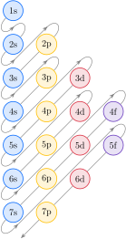

# O átomo de hidrogênio

Nossa tarefa é construir um modelo mecânico quântico do átomo coerente com as observações experimentais, tomando como base as propriedades de onda do elétron e sua função de onda.

## Os níveis de energia

Um elétron em um átomo é como uma partícula em uma caixa, no sentido de que ele está confinado ao átomo, não devido a paredes, mas pela atração do núcleo. Portanto, é possível esperar que as funções de onda do elétron obedeçam a algumas condições de contorno. No caso da partícula em uma caixa, essas restrições resultam na quantização da energia e na existência de níveis discretos de energia. Mesmo neste primeiro momento, você deve esperar que o elétron esteja confinado a certos níveis de energia, exatamente como exigido pelas observações espectroscópicas resumidas no Tópico 1A.

Para encontrar as funções de onda e os níveis de energia de um elétron em um átomo de hidrogênio, é necessário resolver a equação de Schrödinger apropriada. Para formular esta equação, que permite o movimento em três dimensões, usamos a expressão da energia potencial de um elétron de carga $-e$ na distância $r$ de um núcleo com carga $+e$, esta energia potencial de *Coulomb* é
$$
    V = -\dfrac{e^2}{4\pi \varepsilon_0 r}
$$
Resolver a equação de Schrödinger para uma partícula com essa energia potencial é difícil, mas Schrödinger o conseguiu em 1927. Ele descobriu que os níveis de energia permitidos para um elétron em um átomo de hidrogênio são
$$
    E_n = -\dfrac{ hc\mathcal{R} }{ n^2 } = -\dfrac{ \pu{13,6 eV} }{ n^2 }
    \quad
    n = 1, 2, \ldots
\tag{2a}
$$
com 
$$
    \mathcal{R} = \dfrac{ m_\mathrm{e} e^4 }{ 8 h^3 \varepsilon_0^2 c }
$$
Esses níveis de energia têm exatamente a forma sugerida pela espectroscopia (Tópico 1A), mas agora a constante de Rydberg, $\mathcal{R}$, está relacionada a diversas constantes fundamentais. Na ciência, é sempre gratificante perceber que uma variável experimental tem relação com uma combinação de constantes fundamentais. Quando os valores adequados das constantes são inseridos, o valor obtido é $\mathcal{R} = \pu{1,1e7 m-1}$, o mesmo valor determinado experimentalmente. A concordância foi um triunfo para a teoria de Schrödinger e para a mecânica quântica. É fácil imaginar a emoção que Schrödinger sentiu quando chegou a esse resultado. Uma expressão muito semelhante se aplica a outros íons com um elétron, como $\ce{He^+}$ e mesmo $\ce{C^{5+}}$, com o número atômico $Z$:
$$
    E_n = -\dfrac{ Z^2 hc\mathcal{R} }{ n^2 }
    \quad
    n = 1, 2, \ldots
\tag{2b}
$$

:::info

### O que esta equação revela?

Primeiro, observe que todas as energias são negativas, isto é, um elétron tem energia menor no átomo do que quando está distante do núcleo. Outro aspecto é que $n$ é um número quântico, que só pode ter valores inteiros, o que significa que as energias só podem ter valores discretos. Como $n$ aparece no denominador, à medida que $n$ aumenta, as energias dos níveis sucessivos também sobem (isto é, tornam-se menos negativas), aproximando-se de zero quando o elétron está a ponto de escapar do átomo. Além disso, como $Z$ aparece no numerador da Equação 1b, vemos que quanto maior for a carga do núcleo, mais fortemente o elétron estará ligado a ele.

:::

É importante pensar nas razões pelas quais determinada propriedade depende de diversos parâmetros de modo particular. Você deve estar se perguntando: por que a energia depende de $Z^2$ e não de $Z$? A razão pode ser atribuída a dois fatores que se complementam. Primeiro, um núcleo de número atômico $Z$ e carga $Ze$ dá origem a um campo que é $Z$ vezes mais forte do que o de um único próton. Segundo, o elétron é atraído pela carga mais alta e está $Z$ vezes mais próximo do núcleo do que no átomo de hidrogênio. Os dois fatores atuam em conjunto para promover um abaixamento global de energia, proporcional a $Z^2$.

O nível de energia mais baixo, que é o mais negativo possível para o elétron em um átomo de hidrogênio, é obtido quando $n = 1$ e é $-hc \mathcal{R} = \pu{13,6 eV}$. Esse estado de energia é conhecido como o estado **fundamental do átomo**. Um átomo de hidrogênio normalmente é encontrado em seu estado fundamental, com o elétron no nível $n = 1$. Quando o elétron ligado é excitado pela absorção de um fóton ou é bombardeado por outras partículas, sua energia aumenta a um nível maior de $n$. Ele atinge $E = 0$, quando $n$ tende a infinito. Nesse ponto, o elétron efetivamente se liberou do átomo, no processo denominado ionização. A energia de ionização, discutida em detalhes no Tópico 1C, é a energia necessária para atingir a ionização a partir do estado fundamental. Qualquer energia adicional, além da energia de ionização, simplesmente se soma à energia cinética do elétron liberado.

> Os níveis de energia de um átomo de hidrogênio são definidos pelo número quântico principal, $n = 1, 2, \ldots$ e formam uma série convergente.

## Os números quânticos, as camadas e as subcamadas

Quando a equação de Schrödinger é resolvida para um átomo tridimensional, observa-se que são necessários três números quânticos para caracterizar cada função de onda. Os três números quânticos são chamados de $n$, $l$ e $m_l$:

- $n$ está associado ao *tamanho* e à energia do orbital
- $l$ está associado a sua *forma*
- $m_l$ está associado com sua *orientação* espacial

Você já conhece $n$, o número quântico principal, que especifica a energia do orbital em um átomo de um elétron (veja a Equação 1). Em um átomo com um elétron, todos os orbitais atômicos com o mesmo valor de $n$ têm a mesma energia e dizemos que eles pertencem à mesma **camada** do átomo. O termo reflete o fato de que quando $n$ aumenta, a região de máxima densidade de probabilidade parece-se com uma concha oca de raio progressivamente maior. A distância média entre um elétron e o núcleo aumenta com o valor de $n$.

O segundo número quântico necessário para especificar um orbital é $l$, o **número quântico do momento angular do orbital**. Esse número quântico pode ter os valores
$$
    l = 0, 1, 2, \ldots, n-1
$$
Existem $n$ valores diferentes de $l$ para cada valor de $n$. Para $n = 3$, por exemplo, $l$ pode assumir qualquer um dos valores $0$, $1$ e $2$. Os orbitais de uma camada com número quântico principal $n$, portanto, são classificados em n subcamadas, grupos de orbitais que têm o mesmo valor de $l$. Existe somente uma subcamada no nível $n = 1$ ($l = 0$), duas no nível $n = 2$ ($l = 0$ e $l = 1$), três no nível $n = 3$, e assim por diante. Todos os orbitais com $l = 0$ são chamados de orbitais $s$, os de $l = 1$ são chamados de orbitais $p$, os de $l = 2 $são chamados de orbitais $d$ e os de $l = 3$ são chamados de orbitais $f$.

Embora valores maiores de $l$ (correspondentes aos orbitais $g, h, \ldots$) sejam possíveis, os valores menores ($0$, $1$, $2$ e $3$) são os únicos que os químicos precisam na prática.

Assim como os valores de n podem ser usados para calcular a energia de um elétron, os valores de $l$ permitem o cálculo de outra propriedade física. Como o nome sugere, $l$ nos dá o momento angular orbital do elétron, uma medida da velocidade com que o elétron "circula" (em termos clássicos) ao redor do núcleo:
$$
    \text{momento angular orbital} = \overbrace{\dfrac{h}{2\pi}}^{\hbar} \sqrt{l(l+1)}
$$
Um elétron em um orbital $s$ (um "elétron $s$"), para o qual $l = 0$, tem momento angular do orbital igual a zero. Isso significa que você deve imaginar o elétron não como se estivesse circulando em redor do núcleo, mas simplesmente distribuído igualmente em volta dele. Um elétron em um orbital $p$ ($l = 1$) tem momento angular diferente de zero, de magnitude $\hbar\sqrt{2}$; logo, diferentemente de um elétron $s$, podemos imaginá-lo como se estivesse circulando ao redor do núcleo. Um elétron em um orbital $d$ ($l = 2$) tem momento angular maior, $\hbar\sqrt{6}$; um elétron em um orbital $f$ ($l = 3$) tem momento angular ainda maior, $\hbar\sqrt{12}$, e assim por diante.

Um aspecto importante do átomo de hidrogênio (mas não de átomos com mais de um elétron) é que todos os orbitais de uma mesma camada têm a mesma energia, independentemente do valor do momento angular (observe na Equação 1 que $l$ não aparece na expressão da energia). Os orbitais de uma camada de um átomo de hidrogênio são chamados de degenerados, isto é, têm a mesma energia. Essa degenerescência de orbitais com o mesmo valor de $n$ e diferentes valores de $l$ só é verdadeira no caso do átomo de hidrogênio e dos íons de um elétron (como $\ce{He^+}$ e $\ce{C^{5+}}$).

O terceiro número quântico necessário para especificar um orbital é $m_l$, o número quântico magnético, que distingue os orbitais de uma subcamada. Este número quântico pode assumir os seguintes valores
$$
    m_l = -l+1, -l, \ldots, l-1, l
$$
Existem $2l + 1$ valores diferentes de $m_l$ para um dado valor de $l$ e, portanto, $2l + 1$ orbitais em uma subcamada de número quântico $l$. Por exemplo, para um orbital $p$, $l = 1$ e $m_l = -1, 0, +1$; logo, existem três orbitais $p$ em uma camada. Dito de outro modo, uma subcamada com $l = 1$ tem três orbitais. Orbitais com o mesmo valor de $l$ e diferentes valores de $m_l$ são degenerados mesmo em átomos de muitos elétrons. Logo, os três orbitais $p$ de uma camada são degenerados tanto no hidrogênio como em outros átomos.

:::info

### Nota de boa prática

Como o número quântico magnético pode ter valor negativo ou positivo, sempre escreva o sinal $+$ explicitamente no caso de valores positivos de $m_l$. Por exemplo, escreva $m_l = +1$, não $m_l = 1$.

:::

O número quântico magnético especifica a orientação do movimento orbital do elétron. Mais especificamente, ele revela que o momento angular do orbital em torno de um eixo arbitrário é igual a $m_l \hbar$, enquanto o restante do movimento orbital, para completar a quantidade $\hbar \sqrt{l(l+1)}$, está em torno de outros eixos. Assim, por exemplo, se $m_l = +1$, então o momento angular do orbital do elétron em torno do eixo arbitrário é $+\hbar$, ao passo que se $m_l = -1$, o momento angular do orbital do elétron em torno do mesmo eixo arbitrário é $-\hbar$. A diferença de sinal simplesmente significa que a direção do movimento é a contrária: o elétron em um estado circula em torno do eixo no sentido horário e um elétron no outro estado circula no sentido anti-horário. Se $m_l = 0$, então o elétron não está circulando em torno do eixo arbitrário selecionado, mas está distribuído uniformemente ao redor dele em determinado raio.

> Os orbitais atômicos são representados pelos números quânticos $n$, $l$ e $m_l$, e se dividem em camadas e subcamadas.

## O spin do elétron

O cálculo das energias dos orbitais do hidrogênio proposto por Schrödinger foi um marco no desenvolvimento da teoria atômica moderna. Entretanto, as linhas espectrais observadas não tinham exatamente a mesma frequência predita por ele. Em 1925 (antes do trabalho de Schrödinger, mas após o desenvolvimento, por Bohr, do primeiro modelo do átomo), dois físicos holandeses, naturalizados americanos, Samuel Goudsmit e George Uhlenbeck, propuseram uma explicação para essas pequenas diferenças. Eles sugeriram que o elétron possuía uma propriedade chamada de **spin**. A teoria de Schrödinger não levava em conta o spin, mas isso acabou acontecendo naturalmente quando o físico britânico Paul Dirac encontrou um modo (em 1928) de combinar a teoria da relatividade de Einstein com o procedimento de Schrödinger.

De acordo com a mecânica quântica, um elétron tem dois estados de spin, representados pelas setas $\uparrow$ (para cima) e $\downarrow$ (para baixo). Os dois estados de spin são distinguidos por um quarto número quântico, o número quântico magnético de spin, $m_s$. Este número quântico só pode assumir dois valores: $-1/2$ indica um elétron $\uparrow$ e $+1/2$ indica um elétron $\downarrow$.

Dois cientistas alemães, Otto Stern e Walter Gerlach, foram os primeiros a detectar o spin do elétron experimentalmente, em 1922. Como uma carga elétrica em movimento gera um campo magnético, eles previram que um elétron com spin deveria se comportar como um pequeno ímã. Em seu experimento (veja a ilustração), Stern e Gerlach removeram todo o ar de um recipiente e fizeram passar por ele um campo magnético muito pouco uniforme. Depois, eles dispararam um feixe fino de átomos de prata pelo recipiente na direção de um detector. Um átomo de prata tem um elétron desemparelhado. Os 46 elétrons restantes são emparelhados. Por isso, o átomo se comporta como um elétron desemparelhado que se desloca sobre uma plataforma pesada.

Se o elétron tem spin, ele se comportaria como um ímã capaz de adotar qualquer orientação em relação ao campo magnético aplicado. Nesse caso, uma faixa larga de átomos de prata deveria aparecer no detector, porque o campo atrairia os átomos de prata diferentemente, de acordo com a orientação do spin. Foi exatamente isso que Stern e Gerlach observaram quando fizeram o experimento pela primeira vez.

> Um elétron tem a propriedade de spin. O número quântico $m_s$ descreve o spin, $m_s = \pm 1/2$.

## A estutura eletrônica do hidrogênio

No estado fundamental, o elétron está no nível de energia mais baixo, o estado com $n = 1$. O único orbital com $n = 1$ é o orbital $s$. Dizemos que o elétron **ocupa** um orbital $1s$, ou que é um "elétron $1s$". O elétron do átomo de hidrogênio no estado fundamental é descrito por quatro números quânticos, cujos valores são:
$$
    n = 1
    \quad
    l = 0
    \quad
    m_l = 0
    \quad
    m_s = +\tfrac{1}{2} \text{ ou } -\tfrac{1}{2}
$$
O elétron pode adotar qualquer um dos estados de spin.

Quando o átomo adquire energia suficiente (pela absorção de um fóton de radiação, por exemplo) para que seu elétron atinja a camada em que $n = 2$, ele pode ocupar qualquer um de quatro orbitais. Nessa camada, existem um orbital $2s$ e três orbitais $2p$ e, no hidrogênio, todos têm a mesma energia. Quando um elétron é descrito por uma dessas funções de onda, dizemos que ele ocupa um orbital $2s$ ou um orbital $2p$, ou, então, que ele é um "elétron $2s$" ou um "elétron $2p$", respectivamente. A distância média de um elétron ao núcleo quando ele ocupa um dos orbitais da camada $n = 2$ é maior do que quando ele ocupa a camada $n = 1$. Podemos, então, imaginar que o átomo aumenta de tamanho quando é excitado pela energia.

Se o átomo adquire ainda mais energia, o elétron move-se para a camada em que $n = 3$ e o átomo aumenta ainda mais. Nessa camada, o elétron pode ocupar qualquer um de nove orbitais (um $3s$, três $3p$ e cinco $3d$). Quando o átomo absorve mais energia ainda, o elétron se afasta novamente do núcleo e ocupa a camada em que $n = 4$, na qual 16 orbitais estão disponíveis (um $4s$, três $4p$, cinco $4d$ e sete $4f$). A absorção de energia prossegue, até ser suficiente para que o elétron possa escapar da atração do núcleo e, assim, deixar o átomo.

> O estado de um elétron em um átomo de hidrogênio é definido pelos quatro números quânticos $n$, $l$, $m_l$ e $m_s$. À medida que o valor de $n$ aumenta, aumenta também o tamanho do átomo.

# Os átomos polieletrônicos

Todos os átomos neutros, exceto o hidrogênio, têm mais de um elétron e são conhecidos como **átomos polieletrônicos**. Esta seção se baseia na descrição do átomo de hidrogênio para explicar como a presença de mais de um elétron afeta as energias dos orbitais atômicos e o modo como eles são ocupados. As estruturas eletrônicas resultantes são a chave das propriedades periódicas dos elementos e da capacidade dos átomos de formar ligações químicas. Este material, portanto, embasa quase todos os aspectos da química.

## A energia dos orbitais

No átomo de hidrogênio, com um elétron, não ocorre repulsão elétron-elétron e todos os orbitais de uma determinada camada são degenerados (têm a mesma energia). Por exemplo, o orbital $2s$ e os três orbitais $2p$ têm a mesma energia. No entanto, cálculos e experimentos em espectroscopia com átomos polieletrônicos mostraram que as repulsões elétron-elétron tornam a energia dos orbitais 2p mais alta do que a de um orbital $2s$. O mesmo ocorre na camada n 53, em que os três orbitais 3p ficam acima do orbital $3s$ e os cinco orbitais 3d ficam ainda mais altos. Como explicar essas diferenças de energia?

Assim como é atraído pelo núcleo, cada elétron de um átomo de muitos elétrons é repelido pelos demais elétrons. Como resultado, ele está menos fortemente ligado ao núcleo do que estaria na ausência dos outros elétrons. Cada elétron é blindado pelos demais contra a atração total do núcleo. A blindagem reduz efetivamente a atração entre o núcleo e os elétrons. A carga nuclear efetiva, $Z_\mathrm{ef}$, sentida pelo elétron, é sempre menor do que a carga nuclear real, $Ze$, porque as repulsões elétron-elétron trabalham contra a atração do núcleo. Uma aproximação grosseira da energia de um elétron em um átomo polieletrônico é uma versão da Equação 2b, em que a carga nuclear verdadeira é substituído pelo carga nuclear efetiva:
$$
    E_n = -\dfrac{ Z_\mathrm{ef}^2 hc\mathcal{R} }{ n^2 }
    \quad
    n = 1, 2, \ldots
\tag{3}
$$
Observe que os demais elétrons não *bloqueiam* a influência do núcleo. Eles criam simplesmente um interação repulsiva coulombiana adicional que corrige parcialmente a atração do núcleo sobre os elétrons. A atração do núcleo sobre os elétrons no átomo de hélio, por exemplo, é menor do que aquela que a carga $+2e$ deveria exercer, mas é maior do que a carga $+e$ que seria esperada se cada elétron balanceasse exatamente uma carga positiva.

Um elétron $s$ de qualquer das camadas pode ser encontrado em uma região muito próxima do núcleo (lembre-se de que $\phi^2$, para um orbital $s$, é diferente de zero no núcleo), e dizemos que ele **penetra** as camadas internas. Um elétron $p$ penetra muito menos, porque o momento angular do orbital impede a aproximação entre o elétron e o núcleo (Figura XXX). Vimos que sua função de onda se anula no núcleo; logo, a densidade de probabilidade do elétron no núcleo é zero para um elétron $p$. Como o elétron $p$ penetra menos que um elétron $s$ as camadas internas do átomo, ele está mais efetivamente blindado em relação ao núcleo e, por isso, experimenta uma carga efetiva menor do que a de um elétron $s$. Em outras palavras, um elétron s está mais firmemente ligado ao núcleo do que um elétron $p$ e tem energia ligeiramente menor (mais negativa). Um elétron $d$ está menos firmemente ligado ao núcleo do que um elétron $p$ da mesma camada, porque o momento angular orbital é maior e o elétron é menos capaz ainda de se aproximar do núcleo. Isso significa que os elétrons d têm energia mais alta do que os elétrons p da mesma camada, que, por sua vez, têm energia mais alta do que os elétrons $s$ daquela camada.

Os efeitos da penetração e da blindagem podem ser grandes. Um elétron $\ce{4s}$ costuma ter energia muito mais baixa do que um elétron $\ce{4p}$ ou $\ce{4d}$. Ele pode até ter energia inferior à de um elétron $\ce{3d}$ do mesmo átomo. A ordem precisa da energia dos orbitais depende do número de elétrons no átomo, como será explicado a seguir.

Por causa dos efeitos da penetração e da blindagem, a ordem das energias dos orbitais em uma dada camada em um átomo polieletrônico é $\ce{s} < \ce{p} < \ce{d} < \ce{f}$.

## O princípio da construção

A estrutura eletrônica de um átomo determina suas propriedades químicas e, por isso, é preciso ser capaz de descrever essa estrutura. Para isso, você escreve a **configuração eletrônica** do átomo --- uma lista de todos os orbitais ocupados, com o número de elétrons que cada um contém. No estado fundamental de um átomo com muitos elétrons, os elétrons ocupam os orbitais atômicos disponíveis, de modo a tornar a energia total do átomo a menor possível. À primeira vista, poderíamos esperar que um átomo tivesse a menor energia quando todos os seus elétrons estivessem no orbital de menor energia (o orbital 1s). Porém, exceto para o hidrogênio e o hélio, que só têm dois elétrons, isso não pode acontecer. Em 1925, o cientista austríaco Wolfgang Pauli descobriu uma regra fundamental sobre os elétrons e orbitais, conhecida hoje como **princípio da exclusão de Pauli**:

- *Dois elétrons, no máximo, podem ocupar um dado orbital. Quando dois elétrons ocupam um orbital, seus spins devem estar emparelhados.*

Diz-se que os spins de dois elétrons estão emparelhados se um é $\uparrow$ e o outro, $\downarrow$. Os spins emparelhados são representados como $\uparrow\downarrow$, e os elétrons com spins emparelhados têm
números quânticos magnéticos de spin de sinais opostos. Como um orbital atômico é determinado por três números quânticos ($n$, $l$ e $m_l$) e os dois estados de spin são especificados por um quarto número quântico, $m_s$, outra forma de expressar o princípio da exclusão de Pauli é:

- *Dois elétrons em um átomo nunca podem ter o mesmo conjunto de quatro números quânticos.*

O átomo de hidrogênio tem, no estado fundamental, um elétron no orbital $\ce{1s}$. Essa estrutura é representada por uma seta no orbital $\ce{1s}$ de um *diagrama de caixas*, que mostra cada orbital como uma *caixa* que pode conter, no máximo, dois elétrons:
$$
    \ce{H}: \; 
    \underset{ \ce{1s^1} }{ \boxed{ \uparrow \hspace{5pt} } }
$$
Sua configuração eletrônica, isto é, uma lista dos orbitais ocupados, é representada por $\ce{1s^1}$ ("um $s$ um"). No estado fundamental do átomo de hélio ($Z = 2$), os dois elétrons estão em um orbital $\ce{1s}$, que é descrito como $\ce{1s^2}$ ("um $\ce{s}$ dois"):
$$
    \ce{He}: \; 
    \underset{ \ce{1s^2} }{ \boxed{ \uparrow \downarrow } }
$$
Como se pode ver, os dois elétrons estão emparelhados. Nessa situação, o orbital $1s$ e a camada $n = 1$ estão completamente ocupados. O átomo de hélio no estado fundamental tem a **camada fechada**, isto é, uma camada em que o número de elétrons é o máximo permitido pelo princípio da exclusão.

:::info

### Nota de boa prática

Quando um único elétron ocupa um orbital, escrevemos, por exemplo, $\ce{1s^1}$ e não $\ce{1s}$, de forma abreviada.

:::

O lítio ($Z = 3$) tem três elétrons. Dois elétrons ocupam o orbital $\ce{1s}$ e completam a camada $n = 1$. O terceiro elétron deve ocupar o próximo orbital de mais baixa energia disponível, o orbital $\ce{2s}$. Logo, o estado fundamental de um átomo de lítio é $\ce{Li}: \ce{1s^2 2s^1}$:
$$
    \ce{Li}: \; 
    \underset{ \ce{1s^2} }{ \boxed{ \uparrow \downarrow } } \;\; 
    \underset{ \ce{2s^1} }{ \boxed{ \uparrow \hspace{5pt} } } \;\; 
$$
Imagine que a estrutura eletrônica deste átomo é formada pelo caroço, parte central que contém os elétrons de orbitais totalmente preenchidos, circundado pelos elétrons de valência (os da camada mais externa). No lítio, o caroço é formado por uma camada fechada semelhante ao caroço $\ce{1s^2}$ do átomo de hélio, representado por $\ce{[He]}$. Este caroço é rodeado por uma camada externa que contém um elétron $\ce{2s}$, de energia mais alta. Assim, a configuração do lítio é $\ce{[He] 2s^1}$. Em geral, somente os elétrons de valência podem se envolver em reações químicas porque os elétrons do caroço estão nos orbitais internos de menor energia e, portanto, estão muito fortemente ligados. Isso significa que o lítio perde somente um elétron ao formar compostos, isto é, ele forma normalmente íons $\ce{Li^+}$, e não íons $\ce{Li^{2+}}$ ou $\ce{Li^{3+}}$.

O elemento com $Z = 4$ é o berílio, $\ce{Be}$, com quatro elétrons. Os primeiros três elétrons tomam a configuração $\ce{1s^2 2s^1}$, como o lítio. O quarto elétron emparelha-se com o elétron $\ce{2s}$, para dar a configuração $\ce{1s^2 2s^2}$, ou, mais simplesmente, $\ce{[He] 2s^2}$:
$$
    \ce{Be}: \; 
    \underset{ \ce{1s^2} }{ \boxed{ \uparrow \downarrow } } \;\; 
    \underset{ \ce{2s^2} }{ \boxed{ \uparrow \downarrow } } \;\; 
$$
Um átomo de $\ce{Be}$ tem, então, um caroço semelhante ao do hélio, rodeado por uma camada de valência com dois elétrons emparelhados. Como o lítio --- e pela mesma razão ---, um átomo de $\ce{Be}$ só pode perder seus elétrons de valência em reações químicas. Assim, ele perde ambos os elétrons $\ce{2s}$ para
formar o íon $\ce{Be^{2+}}$.

O boro ($Z = 5$) tem cinco elétrons. Dois ocupam o orbital $1s$ e completam a camada $n = 1$. Dois ocupam o orbital $2s$. O quinto elétron ocupa um orbital da próxima subcamada disponível, que é um orbital $2p$. Este arranjo de elétrons corresponde à configuração $\ce{1s^2 2s^2 2p^1}$ ou $\ce{[He] 2s^2 2p^1}$:
$$
    \ce{Be}: \; 
    \underset{ \ce{1s^2} }{ \boxed{ \uparrow \downarrow } } \;\; 
    \underset{ \ce{2s^2} }{ \boxed{ \uparrow \downarrow } } \;\; 
    \underset{ \ce{2p^1} }{ \boxed{ \uparrow \hspace{5pt} }\hspace{-0.4pt}\boxed{ \phantom{\uparrow \downarrow} }\hspace{-0.4pt}\boxed{ \phantom{\uparrow \downarrow} } }
$$
que mostra que o boro tem três elétrons de valência em torno de um caroço semelhante ao do hélio.

Temos de tomar outra decisão no caso do carbono ($Z = 6$): o sexto elétron pode ficar junto ao anterior no orbital $\ce{2p}$ ou deve ocupar um orbital $\ce{2p}$ diferente? (Lembre-se de que existem três orbitais $p$ na subcamada, todos com a mesma energia.) Para responder essa questão, é preciso reconhecer que os elétrons estão mais longe um do outro e se repelem menos quando ocupam orbitais $\ce{p}$ diferentes do que quando ocupam o mesmo orbital. Portanto, o sexto elétron ocupa um dos orbitais $\ce{2p}$ vazios e o estado fundamental do carbono é $\mathrm{1s^2 2s^2 2p_x^1 2p_y^1}$
$$
    \ce{C}: \; 
    \underset{ \ce{1s^2} }{ \boxed{ \uparrow \downarrow } } \;\; 
    \underset{ \ce{2s^2} }{ \boxed{ \uparrow \downarrow } } \;\; 
    \underset{ \ce{2p^2} }{ \boxed{ \uparrow \hspace{5pt} }\hspace{-0.4pt}\boxed{ \uparrow \hspace{5pt} }\hspace{-0.4pt}\boxed{ \phantom{\uparrow \downarrow} } }
$$
Os orbitais são representados desta forma somente quando é necessário enfatizar que os elétrons ocupam orbitais diferentes da mesma subcamada. Na maior parte das situações, a forma compacta, como em $\ce{[He] 2s^2 2p^2}$, é suficiente. Observe que, no diagrama de orbitais, os dois elétrons $2p$ foram representados com **spins paralelos** ($\uparrow\uparrow$), para indicar que eles têm os mesmos números quânticos magnéticos de spin. Por razões baseadas na mecânica quântica, dois elétrons com spins paralelos tendem a se repelir. Portanto, esse arranjo tem energia ligeiramente menor do que a do arranjo com elétrons emparelhados. Entretanto, esse tipo de arranjo só é possível quando os elétrons ocupam orbitais diferentes.

Este procedimento é chamado de princípio da construção e pode ser resumido em duas regras. Para predizer a configuração do estado fundamental de um elemento com o número atômico $Z$ e seus $Z$ elétrons:

1. Adicione $Z$ elétrons, um após o outro, aos orbitais, na ordem da Figura 3, porém, não coloque mais de dois elétrons em um mesmo orbital.
2. Se mais de um orbital em uma subcamada estiver disponível, adicione elétrons com spins paralelos aos diferentes orbitais daquela subcamada até completá-la, antes de emparelhar dois elétrons em um dos orbitais.

A primeira regra leva em conta o princípio da exclusão de Pauli. A segunda regra é conhecida como **regra de Hund**, em homenagem ao espectroscopista alemão Friedrich Hund, que a propôs. Esse procedimento dá a configuração do átomo que corresponde à energia total mais baixa, levando em conta a atração dos elétrons pelo núcleo e a repulsão dos elétrons. Quando os elétrons de um átomo estão em estados de energia mais altos do que os preditos pelo princípio da construção, dizemos que o átomo está em um **estado excitado**. A configuração eletrônica $\ce{[He] 2s^1 2p^3}$, por exemplo, representa um ,estado excitado do átomo de carbono.

Um estado excitado é instável e emite um fóton quando o elétron retorna ao orbital que restabelece o estado de energia mínima do átomo.

Em geral, você deveria imaginar um átomo de qualquer elemento como um caroço de gás nobre rodeado pelos elétrons da camada de valência, a camada ocupada mais externa. A camada de valência é a camada ocupada com o maior valor de $n$.

O nitrogênio tem $Z = 7$ e mais um elétron do que o carbono, o que dá $\ce{[He] 2s^2 2p^3}$. Cada elétron $p$ ocupa um orbital diferente e os três têm spins paralelos: 
$$
    \ce{C}: \; 
    \underset{ \ce{1s^2} }{ \boxed{ \uparrow \downarrow } } \;\;
    \underset{ \ce{2s^2} }{ \boxed{ \uparrow \downarrow } } \;\;
    \underset{ \ce{2p^3} }{ \boxed{ \uparrow \hspace{5pt} }\hspace{-0.4pt}\boxed{ \uparrow \hspace{5pt} }\hspace{-0.4pt}\boxed{ \uparrow \hspace{5pt} } }
$$
O oxigênio tem $Z = 8$ e mais um elétron do que o nitrogênio, logo, sua configuração é $\ce{[He] 2s^2 2p^4}$ e dois dos elétrons $\ce{2p}$ estão emparelhados:
$$
    \ce{O}: \; 
    \underset{ \ce{1s^2} }{ \boxed{ \uparrow \downarrow } } \;\;
    \underset{ \ce{2s^2} }{ \boxed{ \uparrow \downarrow } } \;\;
    \underset{ \ce{2p^4} }{ \boxed{ \uparrow \downarrow }\hspace{-0.4pt}\boxed{ \uparrow \hspace{5pt} }\hspace{-0.4pt}\boxed{ \uparrow \hspace{5pt} } }
$$
O flúor, por sua vez, com $Z = 9$, tem mais um elétron do que o oxigênio, e a configuração $\ce{[He] 2s^2 2p^5}$, com um elétron desemparelhado. 
$$
    \ce{F}: \; 
    \underset{ \ce{1s^2} }{ \boxed{ \uparrow \downarrow } } \;\;
    \underset{ \ce{2s^2} }{ \boxed{ \uparrow \downarrow } } \;\;
    \underset{ \ce{2p^5} }{ \boxed{ \uparrow \downarrow }\hspace{-0.4pt}\boxed{ \uparrow \downarrow }\hspace{-0.4pt}\boxed{ \uparrow \hspace{5pt} } }
$$
O neônio, com $Z = 10$, tem mais um elétron do que o flúor. Esse elétron completa a subcamada $\ce{2p}$, levando a $\ce{[He] 2s^2 2p^6}$: 
$$
    \ce{Ne}: \; 
    \underset{ \ce{1s^2} }{ \boxed{ \uparrow \downarrow } } \;\; 
    \underset{ \ce{2s^2} }{ \boxed{ \uparrow \downarrow } } \;\; 
    \underset{ \ce{2p^6} }{ \boxed{ \uparrow \downarrow }\hspace{-0.4pt}\boxed{ \uparrow \downarrow }\hspace{-0.4pt}\boxed{ \uparrow \downarrow } }
$$
De acordo com a Figura XX, o próximo elétron ocupa o orbital $\ce{3s}$, o orbital de menor energia na próxima camada. A configuração do sódio é, então, $\ce{[He] 2s^2 2p^6 3s^1}$, ou, de forma mais resumida, $\ce{[Ne]} \ce{3s^1}$, em que $\ce{[Ne]}$ é um caroço semelhante ao do neônio.

:::example

### Determinação da configuração eletrônica de um elemento

:::

Os orbitais $s$ e $p$ da camada $n = 3$ se completam no argônio, $\ce{[Ne] 3s^2 3p^6}$, um gás incolor, sem cheiro, não reativo, que lembra o neônio. A energia do orbital $\ce{4s}$ é ligeiramente menor do que a dos orbitais $\ce{3d}$. Isso faz com que o próximo orbital a ser preenchido depois do $\pu{3p}$ seja o $\ce{4s}$. Então, as duas próximas configurações eletrônicas são $\ce{[Ar] 4s^1}$ para o potássio e $\ce{[Ar] 4s^2}$ para o cálcio, em que $\ce{[Ar]}$ representa um caroço semelhante ao do argônio, $\ce{1s^2 2s^2 2p^6 3s^2 3p^6}$. Neste ponto, entretanto, os orbitais $\ce{3d}$ começam a ser ocupados.

Em função da ordem do aumento da energia (Figura XX), os próximos 10 elétrons (do escândio, com $Z = 21$, até o zinco, com $Z = 30$) ocupam os orbitais $\ce{3d}$. A configuração eletrônica do estado fundamental do escândio, por exemplo, é $\ce{[Ar] 3d^1 4s^2}$, e a de seu vizinho, o titânio, é $\ce{[Ar] 3d^2 4s^2}$. Observe que, a partir do escândio, os elétrons $\ce{4s}$ são escritos depois dos elétrons $\ce{3d}$: assim que contiverem elétrons, os orbitais $\ce{3d}$ terão menor energia do que os orbitais $\ce{4s}$ (a mesma relação é verdadeira para os orbitais $n\ce{d}$ e $(n+1)\ce{s}$). Essas diferenças em energia são resultado das complexidades causadas pela repulsão entre elétrons. Os elétrons são adicionados sucessivamente aos orbitais $\ce{d}$ à medida que $Z$ aumenta. Entretanto, existem duas exceções: a configuração eletrônica experimental do cromo é $\ce{[Ar] 3d^5 4s^1}$, não $\ce{[Ar] 3d^4 4s^2}$, e a do cobre é  $\ce{[Ar]} \mathrm{3d^{10} 4s^1}$, não  $\ce{[Ar] 3d^9 4s^1}$. Essa discrepância aparente ocorre porque a configuração com a subcamada semipreenchida $\ce{d^5}$ e a configuração com a subcamada completa $d^{10}$, segundo a mecânica quântica, têm energia mais baixa do que a indicada pela teoria simples. Como resultado, pode-se alcançar uma energia total mais baixa quando um elétron ocupa um orbital $\ce{3d}$, em vez do orbital $\ce{4s}$ esperado, se esse arranjo completa uma meia subcamada ou uma subcamada completa.

Os elétrons só ocupam os orbitais $\ce{4p}$ se os orbitais $\ce{3d}$ estiverem completos. A configuração do germânio, $\ce{[Ar]} \mathrm{3d^{10} 4s^2 4p^2}$, por exemplo, é obtida pela adição de dois elétrons aos orbitais $\ce{4p}$ depois de completar a subcamada $\ce{3d}$. O arsênio tem mais um elétron e a configuração é
$\ce{[Ar]} \mathrm{3d^{10} 4s^2 4p^3}$.

O próximo da fila para ocupação é o orbital $\ce{5s}$, seguido pelos orbitais $\ce{4d}$. Nesse caso, a energia do orbital $\ce{4d}$ cai abaixo da energia do orbital $\ce{5s}$ após a acomodação de dois elétrons no orbital $\ce{5s}$. Um efeito semelhante ocorre quando outro conjunto de orbitais internos, os orbitais $\ce{4f}$, começa a ser ocupado. O cério, por exemplo, tem a configuração $\ce{[Xe] 4f^1 5d^1 6s^2}$. Os elétrons continuam a ocupar os sete orbitais $\ce{4f}$, que se completam após a adição de 14 elétrons no itérbio, $\ce{[Xe]} \mathrm{4f^{14} 6s^2}$. Em seguida, os orbitais $\ce{5d}$ são ocupados. Os orbitais $\ce{6p}$ só são ocupados depois que os orbitais $\ce{6s}$, \ce{4f}$ e \ce{5d}$ estão completos no mercúrio. O tálio, por exemplo, tem configuração $\ce{[Xe] 4f14 5d10 6s2 6p1}$. Existe uma série de discrepâncias aparentes na ordem de preenchimento dos orbitais $\ce{4f}$. Essas discrepâncias aparentes ocorrem porque os orbitais $\ce{4f}$ e $\ce{5d}$ têm energias muito próximas. Na verdade, níveis de energia muito próximos são responsáveis pelo fato de
aproximadamente um quarto dos elementos terem configurações eletrônicas que, de algum modo, se desviam dessas regras. Entretanto, para a maior parte dos elementos, elas são um guia útil e um bom ponto de partida para todos eles.

:::example

### Determinação da configuração eletrônica de um elemento pesado

:::

> A configuração eletrônica do estado fundamental de um átomo é predita usando o princípio da construção (junto com a Figura 3), o princípio da exclusão de Pauli e a regra de Hund.

