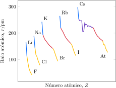

# A Tabela Periódica

A organização da Tabela Periódica é uma das realizações mais notáveis e úteis da química porque ajuda a organizar o que, do contrário, seria um arranjo confuso de propriedades dos elementos. O fato de que a estrutura da Tabela corresponde à estrutura eletrônica dos átomos, entretanto, era desconhecido de seus descobridores. A Tabela Periódica foi desenvolvida exclusivamente a partir das propriedades físicas e químicas dos elementos. 

Em 1869, dois cientistas, o alemão Lothar Meyer e o russo Dmitri Mendeleev, descobriram, cada um em seu próprio laboratório, que os elementos, quando arranjados na ordem crescente das massas atômicas, se agrupavam em famílias com propriedades semelhantes. Mendeleev chamou essa observação de **lei periódica**. Contudo, um dos problemas com a Tabela de Mendeleev era que alguns elementos pareciam fora de lugar. Por exemplo, quando o argônio foi isolado, sua massa aparentemente não correspondia à sua posição na Tabela. O seu peso atômico de $\pu{40}$ (isto é, sua massa molar de $\pu{40 g.mol-1}$) é quase igual ao do cálcio, mas o argônio é um gás inerte e o cálcio é um metal reativo. Essas anomalias levaram os cientistas a questionar o uso do peso atômico como base de organização dos elementos. 

No começo do século XX, Henry Moseley examinou os espectros de raios X dos elementos produzidos no bombardeamento de uma amostra com um feixe de elétrons. Ele percebeu que era possível estimar o número atômico com base na relação entre as frequências dos raios X e a carga nuclear e, portanto, o valor de $Z$. Os cientistas da época não demoraram a perceber que os elementos têm a organização uniformemente repetida da Tabela Periódica se forem organizados pelo número atômico e não pela massa atômica.

## A organização dos elementos

Descobriu-se que, ao serem listados na ordem crescente do número atômico e arranjados em linhas contendo um certo número deles, os elementos formam famílias cujas propriedades têm tendências regulares. O arranjo dos elementos que mostra as relações entre famílias constitui a **Tabela Periódica** (representada de forma esquemática, na Figura 1).

:::singlecolfig

:::

As colunas verticais da Tabela Periódica são chamadas de **grupos**. Esses grupos identificam as principais famílias dos elementos. As colunas mais altas (Grupos 1, 2 e 13 até 18) são os **grupos principais** da Tabela. As linhas horizontais formam os **períodos** e são numeradas de cima para baixo. As quatro regiões retangulares da Tabela constituem **blocos** e, por razões relacionadas com a estrutura atômica, são também chamados de s, p, d e f. Os membros do bloco d, exceto os do Grupo 12 (o grupo do zinco), são os **metais de transição**. O nome indica que eles têm caráter de passagem entre os metais altamente reativos do bloco s e os menos reativos do bloco p. Os membros do bloco f, que aparecem na parte inferior da tabela principal (para economizar espaço), são os **metais de transição internos**. A linha superior desse bloco, começando pelo lantânio (elemento 57), do Período 6, inclui os **lantanoides** (conhecidos tradicionalmente como *lantanídeos*), e a linha inferior, começando actínio (elemento 89), do Período 7, abarca os **actinoides** (conhecidos mais comumente como *actinídeos*). Alguns grupos principais têm nomes especiais:

- Grupo 1: os **metais alcalinos**.
- Grupo 2: os **metais alcalinos-terrosos** (mais precisamente o cálcio, o estrôncio e o bário).
- Grupo 17: os **halogênios**.
- Grupo 18: os **gases nobres**.

No topo da Tabela Periódica, isolado, está o hidrogênio. Algumas versões da Tabela colocam o hidrogênio no Grupo 1; outras, no Grupo 17; e outras, ainda, em ambos os grupos.

Os metais são, em sua maioria, sólidos. Somente dois elementos (mercúrio e bromo) são líquidos nas temperaturas comuns e somente 11 são gases. Os elementos são classificados como metais, não metais e metaloides:

- Um **metal** conduz eletricidade, tem brilho, é maleável e dúctil.
- Um **não metal** não conduz eletricidade e não é maleável nem dúctil.
- Um **metaloide** tem a aparência e algumas propriedades de metal, mas se comporta quimicamente como um não metal, dependendo das condições.

Uma substância *maleável* pode ser martelada até transformar-se em folhas finas, como o cobre. Uma substância *dúctil* pode ser alongada em fios. Muitos não metais são quebradiços e se partem quando são golpeados com um martelo. As distinções entre metais e metaloides e entre metaloides e não metais não são muito precisas (e nem sempre são feitas), mas os sete elementos mostrados na Fig. 2 (na diagonal entre os metais, à esquerda, e os não metais, à direita) são frequentemente considerados metaloides.

> A Tabela Periódica é um arranjo dos elementos que reflete suas relações de família. Os membros do mesmo grupo normalmente mostram a mesma tendência nas propriedades.

## A estrutura geral da Tabela Periódica

Na época em que a Tabela Periódica foi formulada, a razão por trás da periodicidade dos elementos químicos era um mistério. Porém, hoje conseguimos entender a organização da Tabela Periódica em termos da configuração eletrônica dos elementos. A Tabela é dividida em blocos, cujos nomes indicam a última subcamada ocupada de acordo com o princípio da construção (os blocos s, p, d e f). Dois elementos são exceções. Como tem dois elétrons $\mathrm{1s}$, o hélio deveria aparecer no bloco s, mas é colocado no bloco p devido a suas propriedades. Ele é um gás cujas características são semelhantes às dos gases nobres do Grupo 18, não às dos metais reativos do Grupo 2. Sua colocação no Grupo 18 justifica-se porque, assim como os demais elementos do Grupo 18, ele tem a camada de valência completa. O hidrogênio ocupa uma posição única na Tabela Periódica. Ele tem um elétron s, logo, pertence ao Grupo 1; mas tem um elétron a menos do que a configuração de um gás nobre e, assim, pode agir como um membro do Grupo 17. Como o hidrogênio tem esse caráter especial, não o colocamos em grupo algum. Você o encontrará frequentemente no Grupo 1 ou no Grupo 17, e, às vezes, em ambos.

Os blocos s e p formam os grupos principais da Tabela Periódica. As configurações eletrônicas semelhantes dos elementos do mesmo grupo principal são a causa das propriedades semelhantes desses elementos. O número do grupo informa quantos elétrons estão presentes na camada de valência. No bloco s, o número do grupo (1 ou 2) é igual ao número de elétrons de valência. Essa relação se mantém em todos os grupos principais quando se usa a antiga prática dos números romanos (I a VIII) para indicar os grupos. No entanto, ao usar números arábicos (1-18), é preciso subtrair, no bloco p, 10 unidades do número do grupo para encontrar o número de elétrons de valência. O flúor, por exemplo, do Grupo 17 (notação antiga: grupo VII), tem sete elétrons de valência.

Cada novo período corresponde à ocupação de uma camada com o número quântico principal mais alto do que o da anterior. Esta correspondência explica os diferentes comprimentos dos períodos:

- O Período 1 inclui somente dois elementos, $\ce{H}$ e $\ce{He}$, nos quais o orbital $\mathrm{1s}$ da camada $n = 1$ é preenchido com até dois elétrons.
- O Período 2 contém oito elementos, do $\ce{Li}$ ao $\ce{Ne}$, nos quais um orbital $\mathrm{2s}$ e três orbitais $\mathrm{2p}$ são progressivamente preenchidos com mais oito elétrons.
- No Período 3 (do $\ce{Na}$ ao $\ce{Ar}$), os orbitais $\mathrm{3s}$ e $\mathrm{3p}$ vão sendo ocupados por mais oito elétrons.
- No Período 4, os oito elétrons dos orbitais $\mathrm{4s}$ e $\mathrm{4p}$ são adicionados e, também, os 10 elétrons dos orbitais $\mathrm{3d}$. Existem, então, 18 elementos no Período 4.
- Os elementos do Período 5 adicionam outros 18 elétrons, com o preenchimento dos orbitais $\mathrm{5s}$, $\mathrm{4d}$ e $\mathrm{5p}$.
- No Período 6, um total de 32 elétrons é adicionado, porque também é preciso incluir os 14 elétrons dos sete orbitais $\mathrm{4f}$.

Os elementos do bloco f têm propriedades químicas muito semelhantes, porque sua configuração eletrônica difere somente na população dos orbitais f internos, e esses elétrons participam pouco da formação de ligações.

> Os blocos da Tabela Periódica são nomeados segundo o último orbital  ocupado de acordo com o princípio da construção. Os períodos são numerados de acordo com o número quântico principal da camada de valência.

# As propriedades periódicas

A Tabela Periódica pode ser usada na predição de inúmeras propriedades, muitas das quais são cruciais para a compreensão da química. A variação da carga nuclear efetiva, $Z_\mathrm{ef}$, na Tabela Periódica tem papel importante na explicação das tendências da periodicidade, porque ela influencia as energias e as posições dos elétrons nas camadas de valência dos átomos. A Figura 1 mostra a variação da carga efetiva nos três primeiros períodos. Ela cresce da esquerda para a direita em cada período e cai rapidamente na passagem de um período para o outro.

:::think

### Ponto para pensar

Como a carga nuclear efetiva pode afetar as propriedades atômicas, como o tamanho do átomo ou a facilidade com que um elétron externo pode ser removido?

:::

## O raio atômico 

As nuvens de elétrons não têm fronteiras bem definidas, logo, não é possível medir o raio exato de um átomo. Entretanto, a densidade eletrônica de átomos polieletrônicos cai muito rápido na *fronteira* do átomo e, quando os átomos se empacotam para formar sólidos ou se unem para formar moléculas, seus centros encontram-se em distâncias bem definidas uns dos outros. O raio **atômico** de um elemento é definido como a metade da distância entre os núcleos de átomos vizinhos. Logo:

- Se o elemento é um metal, o raio atômico é a metade da distância entre os centros de átomos vizinhos em uma amostra sólida.

Por exemplo, como a distância entre os núcleos vizinhos do cobre sólido é $\pu{256 pm}$, o raio atômico do cobre é $\pu{128 pm}$.

- Se o elemento é um não metal ou um metaloide, usamos a distância entre os núcleos de átomos unidos por uma ligação química. Esse raio é também chamado de raio covalente do elemento, por razões que ficarão claras no Tópico 1E.

Como exemplo, a distância entre os núcleos de uma molécula de $\ce{Cl2}$ é $\pu{198 pm}$; logo, o raio covalente do cloro é $\pu{99 pm}$.

Se o elemento é um gás nobre, usa-se o raio de **van der Waals**, a metade da distância entre os centros de átomos vizinhos em uma amostra do gás solidificado.

Como os átomos de uma amostra de gás nobre não estão ligados quimicamente, os raios de van der Waals são, em geral, muito maiores do que os raios covalentes e é melhor não incluí-los em nossa discussão das tendências de periodicidade.

A Figura 2 mostra os raios atômicos de alguns elementos do grupo principal e a Figura 3 mostra a variação do raio atômico com o número atômico. Observe o padrão denteado. O importante é lembrar que:

- O raio atômico geralmente diminui da esquerda para a direita ao longo de um período e aumenta com o valor de $n$ em cada grupo.

O aumento do raio atômico em cada grupo, como do $\ce{Li}$ para o $\ce{Cs}$, por exemplo, faz sentido: a cada novo período, os elétrons mais externos ocupam as camadas com número quântico principal maior e, portanto, estão mais distantes do núcleo. A diminuição em cada período, como do $\ce{Li}$ para o $\ce{Ne}$, por exemplo, é surpreendente a princípio, porque o número de elétrons aumenta com o número de prótons. A explicação é que os novos elétrons estão na mesma camada e estão tão próximos do núcleo como os demais elétrons da mesma camada, no entanto, como eles estão espalhados na camada, a blindagem dos elétrons uns sobre os outros contra a carga nuclear não é muito eficiente, assim, a carga nuclear efetiva cresce ao longo do período. A maior carga nuclear efetiva atrai os elétrons. Como resultado, o átomo é mais compacto e vemos uma tendência diagonal para os raios atômicos crescerem da direita superior da Tabela Periódica para a esquerda inferior.

:::think

### Ponto para pensar

Que elemento conhecido tem os maiores átomos?

:::

> Os raios atômicos geralmente decrescem da esquerda para a direita em cada período devido ao aumento do número atômico efetivo e crescem em cada grupo quando camadas sucessivas são ocupadas.

## O raio iônico

Os raios dos íons são muito diferentes dos raios dos átomos que lhes dão origem. Em um sólido iônico, cada íon está  rodeado de íons de carga oposta. O raio iônico de um elemento é sua parte da distância entre íons vizinhos em um sólido iônico. Em outras palavras, a distância entre os centros de um cátion e um ânion vizinhos é a soma dos dois raios iônicos. Na prática, o raio do íon óxido é estimado em $\pu{140 pm}$ e calculamos o raio dos outros íons com base nesse valor. Assim, como a distância entre os centros dos íons vizinhos $\ce{Mg^{2+}}$ e $\ce{O^{2-}}$ no óxido de magnésio é $\pu{212 pm}$, o raio do íon $\ce{Mg^{2+}}$ é $\pu{212 pm} - \pu{140 pm} = \pu{72 pm}$.

A Figura 4 mostra as tendências de periodicidade dos raios iônicos. Todos os cátions são menores do que os átomos originais, porque os átomos perdem seus elétrons de valência para formar o cátion e expõem seu caroço, que, geralmente, é muito menor do que o átomo neutro. O raio atômico do $\ce{Li}$, por exemplo, que tem configuração $\mathrm{1s^2 2s^1}$, é $\pu{152 pm}$, mas o raio iônico do $\ce{Li^+}$, o caroço $\mathrm{1s^2}$, semelhante ao hélio, do átomo original é somente $\pu{76 pm}$. Essa diferença de tamanho pode ser comparada à encontrada entre uma cereja e seu caroço. Os átomos no mesmo grupo tendem a formar íons com cargas iguais. Como no caso dos raios atômicos, os raios dos cátions crescem em cada grupo, porque os elétrons ocupam camadas com números quânticos principais sucessivamente maiores.

Os ânions são maiores do que os átomos que lhes deram origem. Isso pode ser atribuído ao aumento do número de elétrons da camada de valência do ânion e aos efeitos de repulsão que os elétrons exercem uns sobre os outros. A variação dos raios dos ânions mostra a mesma tendência diagonal observada nos átomos e nos cátions, com os menores no extremo superior à direita da Tabela Periódica, perto do flúor.

- Os cátions são menores do que os átomos de origem, enquanto os ânions são maiores.

Os átomos e íons que têm o mesmo número de elétrons são chamados de isoeletrônicos. Por exemplo, $\ce{Na^+}$, $\ce{F^-}$ e $\ce{Mg^{2+}}$ são isoeletrônicos. Esses três íons têm a mesma configuração eletrônica, $\ce{[He]}\,\mathrm{2s^2 2p^6}$, porém seus raios são diferentes porque eles têm cargas nucleares diferentes. O íon $\ce{Mg^{2+}}$ tem a maior carga nuclear, logo, a atração do núcleo sobre os elétrons é maior e, portanto, ele tem o menor raio. O íon $\ce{F^-}$ tem a menor carga nuclear dentre os três íons isoeletrônicos e, como resultado, tem o maior raio.

:::example

### Comparação do tamanho de íons

:::

> Os raios iônicos geralmente crescem com o valor de $n$ em um grupo e decrescem da esquerda para a direita em um período. Os cátions são menores e os ânions são maiores do que os átomos que lhes deram origem.

## A energia de ionização

A formação de uma ligação em um composto iônico depende da remoção de um ou mais elétrons de um átomo e de sua transferência para outro átomo. A energia necessária para remover elétrons de um átomo é, portanto, de suma importância para a compreensão de suas propriedades químicas. Como mencionado no Tópico 1B, a energia de ionização, $I$, é a energia necessária para remover um elétron de um átomo na fase gás, especificamente:
$$
    \ce{ J(g) -> J^+(g) + e^-(g) } 
    \quad 
    I_{\ce{J}} = E_{\ce{J^+(g)}} - E_{\ce{J(g)}}
\tag{1}
$$
Em que $E_{\ce{J(g)}}$ é a energia do átomo $\ce{J}$ na fase gás e $E_{\ce{J^-(g)}}$ é a energia do cátion na mesma fase. As energias de ionização são expressas como quantidades molares em joules por mol ou em elétron-volts e representam a variação de energia de um elétron quando ele se move por uma diferença de potencial de $\pu{1 V}$:
$$
    \pu{1 eV} = \pu{1,6e-19 J}
\tag{2}
$$
A **primeira energia de ionização**, $I_1$, é a energia necessária para remover um elétron de um átomo neutro na fase gás. Por exemplo, para o cobre,
$$
    \ce{ Cu(g) -> Cu^+(g) + e^-(g) } 
    \quad 
    I_{1, \ce{Cu}} = \pu{7,73 eV} = \pu{746 kJ.mol-1}
$$
A **segunda energia de ionização**, $I_2$, de um elemento é a energia necessária para remover um elétron de um cátion com carga unitária na fase gás. Para o cobre,
$$
    \ce{ Cu^+(g) -> Cu^{2+}(g) + e^-(g) } 
    \quad 
    I_{2, \ce{Cu}} = \pu{20,3 eV} = \pu{1960 kJ.mol-1}
$$
Como a energia de ionização é uma medida da dificuldade de remover um elétron, os elementos com baixas energias de ionização formam cátions facilmente e conduzem eletricidade (o que exige que alguns elétrons estejam livres para se mover) em suas formas sólidas (ou líquidas). Os elementos com altas energias de ionização formam cátions com dificuldade e não conduzem eletricidade.

:::think

### Ponto para pensar

Por que a segunda energia de ionização de um átomo é sempre maior do que a primeira energia de ionização?

:::

Como mostra a Figura 5:

- As primeiras energias de ionização geralmente decrescem em um grupo.
- As primeiras energias de ionização geralmente aumentam em um período.

O decréscimo em um grupo pode ser explicado pelo fato de, em períodos sucessivos, o elétron mais externo ocupar uma camada mais afastada do núcleo e, por isso, ele está menos preso. Portanto, é necessária menos energia para remover um elétron de um átomo de césio do que de um átomo de sódio.

Com poucas exceções, a primeira energia de ionização cresce da esquerda para a direita no período (Fig. 6). Isso pode ser explicado pelo aumento da carga nuclear efetiva no período. As pequenas discrepâncias observadas se devem às repulsões entre elétrons, particularmente os elétrons que ocupam o mesmo orbital. Por exemplo, a energia de ionização do oxigênio é ligeiramente menor do que a do nitrogênio porque no nitrogênio cada orbital p tem um elétron, mas no oxigênio o oitavo elétron está emparelhado com um elétron que já ocupa um orbital. A repulsão entre os dois elétrons que estão no mesmo orbital aumenta sua energia e faz um deles ser removido do átomo com mais facilidade do que se os dois elétrons estivessem em orbitais diferentes.

A Figura 7 mostra que a segunda energia de ionização de um elemento é sempre maior do que a primeira. Mais energia é necessária para remover um elétron de um íon com carga positiva do que de um átomo neutro. Para os elementos do Grupo 1, a segunda energia de ionização é consideravelmente maior do que a primeira, mas, no Grupo 2, as duas energias de ionização têm valores semelhantes. Essa diferença é razoável, porque os elementos do Grupo 1 têm configuração $n\ce{s^1}$ na camada de valência. Embora a retirada do primeiro elétron requeira pouca energia, o segundo elétron deve sair de um caroço de gás nobre. Os elétrons do caroço têm números quânticos principais menores e estão muito mais próximos do núcleo. Eles são fortemente atraídos por ele e muita energia é necessária para removê-los.

:::example

### Explicação de tendências na energia de ionização

:::

As baixas energias de ionização dos elementos da parte inferior, à esquerda, da Tabela Periódica explicam seu caráter de metal. Um bloco de metal é uma coleção de cátions do elemento rodeados por um mar de elétrons de valência não ligados perdidos pelos átomos (Figura 1F.11). Somente os elementos com baixas energias de ionização --- os membros do  bloco s, do bloco d, do bloco f e os da parte inferior, à esquerda, do bloco p --- conseguem formar sólidos metálicos, porque somente eles podem perder elétrons com facilidade.

Os elementos que estão na parte superior direita da Tabela Periódica têm altas energias de ionização e não perdem elétrons com facilidade. Por isso eles não são metais. Observe que sua compreensão da estrutura eletrônica o ajudou a entender uma propriedade importante da Tabela Periódica --- neste caso, por que os metais aparecem na parte inferior, à esquerda, e os não metais, na parte superior, à direita.

> A primeira energia de ionização é maior para os elementos próximos do hélio e menor para os que estão próximos do césio. A segunda energia de ionização é maior do que a primeira energia de ionização (do mesmo elemento) e a diferença é muito maior se o segundo elétron tiver de ser retirado de uma camada fechada. Os metais são encontrados na parte inferior, à esquerda, da Tabela Periódica porque esses elementos têm baixa energia de ionização e podem perder elétrons com facilidade.

## A afinidade eletrônica

Para predizer algumas propriedades químicas, é necessário saber como a energia muda quando um elétron se liga a um átomo. A **afinidade eletrônica**, $E_\mathrm{ae}$, de um elemento é a energia liberada quando um elétron se liga a um átomo na fase gás. Uma afinidade eletrônica positiva significa que energia é liberada quando um elétron se liga a um átomo. Uma afinidade eletrônica negativa significa que é necessário fornecer energia para fazer um elétron se ligar a um átomo. Esta convenção é baseada no sentido mais usual do termo *afinidade*. Em um linguagem mais formal, a afinidade eletrônica de um elemento $\ce{X}$ é definida como:
$$
    \ce{ X(g) + e^-(g) -> X^-(g) } 
    \quad E_{\mathrm{ea}, \ce{X}} = E_{\ce{X(g)}} - E_{\ce{X^-(g)}}
$$
Em que $E_{\ce{X(g)}}$ é a energia do átomo $\ce{X}$ na fase gás e $E_{\ce{X^-(g)}}$ é a energia do ânion na mesma fase. Por exemplo, a afinidade do cloro é a energia liberada no processo
$$
    \ce{ Cl(g) + e^-(g) -> Cl^-(g) } 
    \quad E_{\mathrm{ea}, \ce{Cl}} = \pu{3,62 eV} = \pu{349 kJ.mol-1}
$$
Como o elétron tem energia mais baixa quando ocupa um dos orbitais do átomo, a diferença $E_{\ce{Cl(g)}} - E_{\ce{Cl^-(g)}}$ é positiva e a afinidade eletrônica do cloro é positiva. Como as energias de ionização, as afinidades eletrônicas são registradas em elétron-volts para um átomo isolado ou em joules por mol de átomos.

A Figura 7 mostra a variação da afinidade eletrônica nos grupos principais da Tabela Periódica. Ela é muito menos periódica do que a variação do raio e da energia de ionização. Entretanto, uma tendência é claramente visível. Com exceção dos gases nobres:

- As afinidades eletrônicas são maiores à direita da Tabela Periódica.

Essa tendência é particularmente verdadeira na parte superior direita, perto do oxigênio, do enxofre e dos halogênios. Nesses átomos, o elétron adicionado ocupa um orbital p próximo de um núcleo com carga efetiva elevada e sofre intensamente sua atração. Os gases nobres têm afinidades eletrônicas negativas porque qualquer elétron adicionado deve ocupar um orbital no exterior de uma camada completa e distante do núcleo: esse processo requer energia e, portanto, a afinidade eletrônica é negativa.

Quando um elétron entra na única vaga da camada de valência de um átomo do Grupo 17, a camada se completa e qualquer elétron adicional deve iniciar uma nova camada. Nessa nova camada, ele não somente estaria mais afastado do núcleo como também sentiria a repulsão da carga negativa já existente. Como resultado, a segunda afinidade eletrônica do flúor é fortemente negativa, o que significa que muita energia é consumida para formar $\ce{F^{2-}}$ a partir de $\ce{F^-}$. Por isso, os compostos iônicos dos halogênios utilizam íons com carga unitária, como o $\ce{F^-}$, e nunca íons com duas cargas, como o $\ce{F^{2-}}$.

Um átomo do Grupo 16, como $\ce{O}$ ou $\ce{S}$, tem duas vagas nos orbitais p da camada de valência e pode acomodar dois elétrons adicionais. A primeira afinidade eletrônica é positiva, porque energia é liberada quando um elétron é adicionado a $\ce{O}$ ou $\ce{S}$. A colocação do segundo elétron, entretanto, requer energia por causa da repulsão provocada pela carga negativa já existente em $\ce{O^-}$ ou $\ce{S^-}$. Diferentemente do caso dos halogênios, a camada de valência do ânion $\ce{O^-}$ só tem sete elétrons e pode, portanto, acomodar mais um. Por isso, podemos esperar que a energia necessária para fazer $\ce{O^{2-}}$ a partir de $\ce{O^-}$ seja menor do que a necessária para fazer $\ce{F^{2-}}$ a partir de $\ce{F^-}$, em que não existe essa vacância. Na verdade, $\pu{141 kJ.mol-1}$ são liberados quando o primeiro elétron é adicionado ao átomo neutro para formar $\ce{O^-}$, porém $\pu{844 kJ.mol-1}$ devem ser fornecidos para adicionar o segundo elétron e formar $\ce{O^{2-}}$. Assim, a energia total requerida para fazer $\ce{O^{2-}}$ a partir de $\ce{O}$ é $\pu{703 kJ.mol-1}$. Essa energia pode ser obtida em reações químicas, e os íons $\ce{O^{2-}}$ são típicos de óxidos de metais.

:::example

### Explicação de tendências na afinidade eletrônica

:::

> Os elementos dos Grupos 16 e 17 são os que têm afinidades eletrônicas mais altas.

## O efeito do par inerte

Embora o alumínio e o índio estejam no Grupo 13, o alumínio forma íons $\ce{Al^{3+}}$, enquanto o índio forma íons $\ce{In^{3+}}$ e $\ce{In^+}$. A tendência a formar íons de carga com menos duas unidades do que o esperado para o número do grupo é conhecida como **efeito do par inerte**. Outro exemplo do efeito do par inerte é encontrado no Grupo 14: o estanho forma óxido de estanho(IV) quando aquecido ao ar, mas o átomo de chumbo, mais pesado, perde somente seus dois elétrons p e forma óxido de chumbo(II). O óxido de estanho(II) pode ser preparado, mas se oxida rapidamente a óxido de estanho(IV). O chumbo mostra o efeito do par inerte muito mais fortemente do que o estanho.

O efeito do par inerte é devido, em parte, às energias relativas dos elétrons de valência s e p. Nos períodos mais tardios da Tabela Periódica, os elétrons de valência s têm energia muito
baixa por causa de sua boa penetração e da baixa capacidade de blindagem dos elétrons d. Os elétrons de valência s podem, então, permanecer ligados ao átomo durante a formação do
íon. O efeito do par inerte é mais saliente nos átomos pesados de um grupo, em que a diferença de energia entre os elétrons s e p é maior. Ainda assim, o par de elétrons s pode ser removido de um átomo sob condições suficientemente vigorosas. Um par inerte poderia ser chamado de *par preguiçoso* de elétrons.

> O efeito do par inerte é a tendência de formar íons de carga duas unidades a menos do que o esperado para o número do grupo. Isso é mais saliente nos elementos mais pesados do bloco p.

## As relações diagonais

As **relações diagonais** são semelhanças de propriedades entre vizinhos diagonais nos grupos principais da Tabela Periódica. Uma parte do  porquê dessa semelhança pode ser vista na Fig. 1F.8, observando as cores que mostram as tendências gerais dos raios atômicos e das energias de ionização. As bandas coloridas de valores semelhantes ocorrem em faixas diagonais ao longo da tabela. Como essas características afetam as propriedades químicas de um elemento, não é surpresa verificar que os elementos de uma faixa diagonal têm propriedades químicas semelhantes. As relações diagonais são úteis na predição das propriedades dos elementos e de seus compostos.

A banda diagonal dos metaloides que divide os metais dos não metais é outro bom exemplo de relação diagonal. O mesmo acontece com a semelhança química entre o lítio e o magnésio e entre o berílio e o alumínio. Por exemplo, o lítio e o magnésio reagem diretamente com o nitrogênio para formar nitretos. Como o alumínio, o berílio reage com ácidos e bases.

> Os pares de elementos com relação diagonal mostram, com frequência, propriedades químicas semelhantes.

## As propriedades gerais dos elementos

Com base no que foi apresentado, você já pode começar a predizer, pelo menos de modo geral, as propriedades dos elementos. Por exemplo, um elemento do bloco s tem baixa energia de ionização, o que quer dizer que seus elétrons mais externos podem ser perdidos com facilidade. Um elemento do bloco s muito provavelmente será um metal reativo com todas as características que o nome *metal* envolve (Tabela 1F.1). Estes metais são macios, brilhantes e fundem em temperaturas baixas, produzindo hidrogênio quando entram em contato com a água. Como as energias de ionização são menores na parte inferior de cada grupo e os elementos dessas posições perdem seus elétrons de valência com muito mais facilidade, os elementos pesados césio e bário reagem mais vigorosamente do que os demais elementos do bloco s e devem ser guardados fora do contato com o ar e a água.

Os elementos à esquerda do bloco p, especialmente os elementos mais pesados, têm energias de ionização suficientemente baixas para ter algumas das propriedades de metais dos membros do bloco s. Entretanto, as energias de ionização dos metais do bloco p são muito mais altas e, por isso, eles são menos reativos do que os do bloco s.

Os elementos à direita do bloco p, com exceção dos gases nobres, têm afinidades eletrônicas caracteristicamente altas: eles tendem a ganhar elétrons para completar a camada. Os elementos do Grupo 18, os gases nobres, têm camadas completas e, portanto, são tão pouco reativos que, no passado, eram chamados de *gases inertes*. Exceto pelos metaloides telúrio e polônio, os membros dos Grupos 16 e 17 são não metais. Em geral, eles formam compostos moleculares entre si.

Todos os elementos do bloco d são metais e muitas vezes são chamados de *metais do bloco d*. Suas propriedades são intermediárias entre os elementos do bloco s e os do bloco p, o que explica (com a exceção dos membros do Grupo 12) seu nome alternativo,
*metais de transição*.

Quando um átomo de um elemento d perde elétrons para formar um cátion, ele perde primeiro os elétrons s externos. Entretanto, a maior parte dos elementos do bloco d forma íons com estados de oxidação diferentes porque os elétrons d têm energias semelhantes e um número variável deles pode se perder ao formar compostos. O ferro, por exemplo, forma $\ce{Fe^{2+}}$ e $\ce{Fe^{3+}}$; o cobre forma $\ce{Cu^+}$ e $\ce{Cu^{2+}}$. Embora o cobre seja semelhante ao potássio porque o elétron mais externo é um elétron s, o potássio só forma $\ce{K^+}$. A razão disso pode ser compreendida ao comparar a segunda energia de ionização, que é $\pu{1958 kJ.mol-1}$ para o cobre e $\pu{3051 kJ.mol-1}$ para o potássio. Para formar $\ce{Cu^{2+}}$, um elétron é removido da subcamada d do $\ce{[Ar]}\,\mathrm{3d^{10}}$, porém, para formar $\ce{K^{2+}}$, o elétron teria de ser retirado do caroço semelhante ao argônio do potássio.

A disponibilidade dos orbitais d e a semelhança dos raios atômicos dos elementos do bloco d têm impacto significativo em muitas áreas que nos afetam. A disponibilidade dos orbitais d é, em grande parte, responsável pela ação dos elementos do bloco d e dos compostos que eles formam como catalisadores (substâncias que aceleram as reações mas não são consumidas no processo) na indústria química. Assim, o ferro é usado na manufatura da amônia; o níquel, na conversão de óleos vegetais em óleos comestíveis; a platina, na manufatura de ácido nítrico; o óxido de vanádio(V), na manufatura de ácido sulfúrico; e os compostos de titânio, na manufatura de polietileno. A capacidade de formar íons com diferentes cargas é importante porque facilita as reações delicadas que ocorrem em organismos vivos. Por exemplo, o ferro está presente como ferro(II) na hemoglobina, a proteína ques transporta oxigênio no sangue dos mamíferos; o cobre, nas proteínas responsáveis pelo transporte de elétrons; e o manganês, nas proteínas responsáveis pela fotossíntese. A semelhança de seus raios atômicos é, em grande parte, responsável pela capacidade dos metais de transição de formar as misturas conhecidas como ligas, especialmente a grande variedade de aços que viabilizam a engenharia moderna.

As dificuldades em separar e isolar os lantanoides (também chamados de *lantanídeos*, em linguagem coloquial) retardaram seu uso tecnológico. Entretanto, hoje eles são intensamente estudados, pois os materiais supercondutores com frequência contêm lantanoides. Todos os actinoides (e, portanto, os *actinídeos*) são radioativos. Nenhum dos elementos que estão depois do plutônio na Tabela Periódica tem abundância natural significativa na Terra. Como eles são fabricados somente em reatores nucleares ou em aceleradores de partículas, só estão disponíveis em pequenas quantidades.

> Todos os elementos do bloco s são metais reativos que formam óxidos básicos. Os elementos do bloco p tendem a ganhar elétrons para completar camadas; eles vão de metais a metaloides e não metais. Todos os elementos do grupo d são metais com propriedades intermediárias entre as dos metais do bloco s e as dos metais do bloco p. Muitos elementos do bloco d formam cátions com mais de um estado de oxidação.

