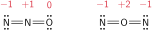

# Os compostos inorgânicos

Os poucos elementos que constituem nosso mundo combinam-se para produzir a matéria em uma aparentemente ilimitada variedade de formas. Basta olhar para a vegetação, a carne, as paisagens, os tecidos, os materiais de construção e outras coisas à nossa volta para apreciar a maravilhosa variedade do mundo material. Uma parte da química é a **análise**: a identificação dos elementos que se combinaram para formar uma substância. Outro aspecto da química é a **síntese**: o processo de combinar elementos para produzir compostos ou de converter um composto em outro. Se os elementos são o alfabeto da química, então os compostos são suas peças de teatro, poemas e histórias.

## O que são compostos?

Um **composto** é uma substância eletricamente neutra, formada por dois ou mais elementos diferentes cujos átomos estão em uma proporção definida. Um **composto binário** é formado por dois elementos. A água, por exemplo, é um composto binário de hidrogênio e oxigênio, com dois átomos de hidrogênio para cada átomo de oxigênio. Qualquer que seja a fonte de água, sua composição é a mesma. Sem dúvida, uma substância com uma razão atômica diferente não seria água! O peróxido de hidrogênio ($\ce{H2O2}$), por exemplo, tem um átomo de hidrogênio para cada átomo de oxigênio.

Os compostos podem ser classificados como orgânicos ou inorgânicos. Os **compostos orgânicos** contêm o elemento carbono e, normalmente, também o hidrogênio. Existem milhões de compostos orgânicos, inclusive combustíveis, como o metano ou o propano, açúcares, como a glicose e a sacarose, e a maior parte dos medicamentos. Esses compostos são denominados orgânicos porque se acreditava, incorretamente, que só poderiam ser sintetizados pelos organismos vivos. Os **compostos inorgânicos** são todos os demais compostos. Eles incluem água, sulfato de cálcio, amônia, sílica, ácido clorídrico e muitos outros. Além disso, compostos muito simples de carbono, particularmente o dióxido de carbono e os carbonatos, que incluem o giz (carbonato de cálcio), são tratados como compostos inorgânicos.

Em um composto, os elementos não estão apenas misturados. Seus átomos estão unidos, ou *ligados*, uns aos outros de maneira específica, devido a uma reação química. O resultado é uma substância com propriedades químicas e físicas diferentes das dos elementos que a formam. Quando o enxofre se queima no ar, por exemplo, ele se combina com o oxigênio para formar o dióxido de enxofre. O enxofre, um sólido amarelo, e o oxigênio, um gás inodoro, produzem um gás incolor, irritante e venenoso.

Os químicos determinaram que os átomos podem ligar-se para formar moléculas ou participar de compostos como íons:

- Uma **molécula** é um grupo discreto de átomos ligados em um arranjo específico.
- Um **íon** é um átomo ou um grupo de átomos com carga positiva ou negativa.

Um íon com carga positiva é chamado de **cátion** e um íon com carga negativa, de **ânion**. Assim, um átomo de sódio com carga positiva é um cátion, representado como $\ce{Na^+}$. Um átomo de cloro com carga negativa é um ânion, representado como $\ce{Cl2}$. Um exemplo de cátion *poliatômico* (muitos átomos) é o íon amônio, $\ce{NH4^+}$, e um exemplo de ânion poliatômico é o íon carbonato, $\ce{CO3^{2-}}$. Observe que este último tem duas cargas negativas. Um composto iônico é formado por íons, em uma razão tal que o total é eletricamente neutro. Um composto molecular é formado por moléculas eletricamente neutras.

> Os compostos são combinações de elementos nas quais os átomos de elementos diferentes estão em uma razão constante e característica. Um composto é classificado como molecular se ele é feito de moléculas e como iônico se é feito de íons.

## As moléculas e os compostos moleculares

A **fórmula química** de um composto representa sua composição em termos de símbolos químicos. Os subscritos mostram o número de átomos de cada elemento que estão presentes na menor unidade representativa do composto. Para compostos moleculares, é comum usar a **fórmula molecular**, uma fórmula química que mostra quantos átomos de cada tipo de elemento estão presentes em uma única molécula do composto. Assim, por exemplo, a fórmula molecular da água é $\ce{H2O}$, isto é, cada molécula contém um átomo de $\ce{O}$ e dois átomos de $\ce{H}$. A fórmula molecular da estrona, um hormônio sexual feminino, é $\ce{C18H22O2}$, mostrando que uma molécula de estrona contém 18 átomos de $\ce{C}$, 22 átomos de $\ce{H}$ e 2 átomos de $\ce{O}$. A molécula de um hormônio sexual masculino, a testosterona, apresenta pouca diferença. Sua fórmula molecular é $\ce{C19H28O2}$. Pense nas consequências desta pequena diferença!

Alguns elementos também existem na forma molecular. Exceto os gases nobres, todos os elementos gasosos em temperaturas comuns são encontrados como moléculas diatômicas (com dois átomos) e, em menor proporção, como moléculas triatômicas (com três átomos). As moléculas do gás hidrogênio, por exemplo, contêm dois átomos de hidrogênio e são representadas por $\ce{H2}$. A forma mais comum do oxigênio é composta por moléculas diatômicas, também chamadas de dioxigênio, $\ce{O2}$. Uma forma menos comum, o ozônio, tem fórmula $\ce{O3}$. O enxofre sólido existe como moléculas $\ce{S8}$ e o fósforo ocorre como moléculas $\ce{P4}$. O nitrogênio e todos os halogênios existem como moléculas diatômicas: $\ce{N2}$, $\ce{F2}$, $\ce{Cl2}$, $\ce{Br2}$ e $\ce{I2}$.

## Os íons e os compostos iônicos

Para visualizar os compostos iônicos, você terá de imaginar um grande número de cátions e ânions, juntos, em um arranjo regular tridimensional mantido pela atração entre suas cargas opostas. Cada cristal de cloreto de sódio, por exemplo, é um conjunto ordenado com um número muito grande de íons $\ce{Na^+}$ e $\ce{Cl^-}$ que se alternam. Cada cristal de uma pitada de sal contém mais íons do que todas as estrelas do universo visível.

O modelo nuclear do átomo explica facilmente a existência de **íons monoatômicos** (íons de um átomo). Quando um elétron é removido de um átomo neutro, a carga dos elétrons remanescentes não cancela mais a carga positiva do núcleo. Como um elétron tem uma unidade de carga negativa, cada elétron removido de um átomo neutro deixa um cátion com uma unidade a mais de carga positiva. Assim, um cátion sódio, $\ce{Na^+}$, é um átomo de sódio que perdeu um elétron. Quando um átomo de cálcio perde dois elétrons, torna-se o íon cálcio, com duas cargas positivas, $\ce{Ca^{2+}}$.

Cada elétron ganho por um átomo aumenta a carga negativa em uma unidade. Por isso, quando um átomo de flúor ganha um elétron, torna-se o íon fluoreto, com uma carga negativa, $\ce{F2}$. Quando um átomo de oxigênio ganha dois elétrons, torna-se o íon óxido, com duas cargas, $\ce{O^{2-}}$. Quando um átomo de nitrogênio ganha três elétrons, torna-se o íon nitreto, com três cargas, $\ce{N^{3-}}$.

O padrão de formação de íons pelos elementos do grupo principal pode ser resumido em uma regra simples: para os átomos mais à esquerda ou mais à direita da Tabela Periódica, os átomos perdem ou ganham elétrons até atingir o número de elétrons do átomo do gás nobre mais próximo. Isto é:

- Os elementos dos Grupos 1, 2 e 3 perdem elétrons até atingirem o mesmo número de elétrons do gás nobre no final do período anterior.
- Os elementos dos Grupos 14, 15, 16 e 17 ganham elétrons até atingirem o mesmo número de elétrons do gás nobre no final do seu período.

Por isso, o magnésio perde dois elétrons e torna-se $\ce{Mg^{2+}}$, que tem o número de elétrons do átomo de neônio. O selênio ganha dois elétrons e torna-se $\ce{Se^{2-}}$, que tem o número de elétrons do criptônio.

> Os elementos metálicos normalmente formam cátions, os elementos não metálicos normalmente formam ânions. As cargas dos íons monoatômicos estão relacionadas ao grupo a que pertencem na Tabela Periódica.

# A nomenclatura dos compostos

Muitos compostos receberam nomes informais, os **nomes comuns**, antes de suas composições serem conhecidas. Os nomes comuns incluem, por exemplo, água, sal, açúcar, amônia e quartzo. Um **nome sistemático**, por outro lado, revela os elementos presentes e, em alguns casos, o arranjo dos átomos. A nomeação sistemática dos compostos, a chamada **nomenclatura química**, segue um conjunto simples de regras descritas nesta seção.

## Os nomes dos cátions

O nome de um cátion monoatômico é o nome do elemento que o formou, precedido da palavra íon, como íon sódio para $\ce{Na^+}$. Quando um elemento pode formar mais de um tipo de cátion, como os íons $\ce{Cu^+}$ e $\ce{Cu^{2+}}$ do cobre, usamos, para distingui-los, o número de oxidação, isto é, a carga do cátion, escrita em algarismos romanos entre parênteses, logo após o nome do elemento. Assim, o $\ce{Cu^+}$ é o íon cobre(I) e o $\ce{Cu^{2+}}$ é o íon cobre(II). O $\ce{Fe^{2+}}$ é o íon ferro(II) e o $\ce{Fe^{3+}}$ é o íon ferro(III). A maior
parte dos metais de transição forma mais de um tipo de íon e, por isso, a menos que você tenha outras informações, é importante incluir o número de oxidação nos nomes de seus compostos.

Alguns sistemas mais antigos de nomenclatura ainda são usados. Alguns cátions, por exemplo, eram nomeados com os sufixos *-oso* e *-ico* para os íons com cargas menores e maiores, respectivamente. Para complicar ainda mais, essas terminações eram adicionadas à forma latina do nome dos elementos. Nesse sistema, os íons de ferro(II) eram chamados de íons ferrosos, e os íons de ferro(III), de íons férricos. Embora este sistema não seja adotado neste livro, você poderá se deparar com ele e, por isso, é importante conhecê-lo.

> Dá‑se aos cátions monoatômicos o nome dos elementos, precedido pela palavra íon. No caso dos elementos que formam mais de um cátion, inclui‑se o número de oxidação, em algarismos romanos, para indicar a carga.

## Os nomes dos ânions

Os ânions monoatômicos, como os íons $\ce{Cl^-}$ no cloreto de sódio e os íons $\ce{S^{2-}}$ na blenda de zinco, $\ce{ZnS}$, são designados pela adição do sufixo *-eto* e da palavra íon na primeira parte do nome do elemento (a raiz do nome), logo, $\ce{Cl^-}$ é o íon cloreto, e $\ce{S^{2-}}$ é o íon sulfeto. Uma importante exceção a esta regra é o íon óxido, $\ce{O^{2-}}$. Em geral, não é necessário dar a carga, porque a maior parte dos elementos que formam ânions monoatômicos produz somente uma espécie de íon. Os íons formados pelos halogênios são chamados coletivamente de íons halogeneto e incluem os íons fluoreto, $\ce{F^-}$, cloreto $\ce{Cl^-}$, brometo, $\ce{Br^-}$ e iodeto $\ce{I^-}$.

Os íons poliatômicos incluem os oxoânions, que são íons que contêm oxigênio. Se só existe um oxoânion de um elemento, seu nome é formado pela adição do sufixo *-ato* à raiz do nome do elemento, como no íon carbonato, $\ce{CO3^{2-}}$. Alguns elementos podem formar dois tipos de oxoânions, com números diferentes de átomos de oxigênio, e é preciso distingui-los. O nitrogênio, por exemplo, forma $\ce{NO2^-}$ e $\ce{NO3^-}$. Nestes casos:

- O íon que tem o maior número de átomos de oxigênio recebe o sufixo *-ato*.
- O íon que tem o menor número de átomos de oxigênio recebe o sufixo *-ito*.

Assim, $\ce{NO3^-}$ é nitrato e $\ce{NO2^-}$ é nitrito. O íon nitrato é uma fonte importante de nitrogênio para as plantas e é adicionado a alguns fertilizantes (como nitrato de amônio, $\ce{NH4NO3}$). Alguns elementos --- particularmente os halogênios --- formam mais de duas espécies de oxoânions.

- O nome do oxoânion que tem o menor número de átomos de oxigênio é formado pela adição do prefixo *hipo-* e do sufixo *-ito* à raiz do nome do elemento, como no íon hipoclorito, $\ce{ClO^-}$.
- O oxoânion que tem o maior número de átomos de oxigênio é nomeado pela adição do prefixo *per-* e do sufixo *-ato* à raiz do nome do elemento. Um exemplo é o íon perclorato, $\ce{ClO4^-}$.

O hidrogênio está presente em alguns ânions. Dois exemplos são $\ce{HS^-}$ e $\ce{HCO3^-}$. Os nomes desses ânions começam com o prefixo *hidrogeno*. Assim, $\ce{HS^-}$ é o íon hidrogenossulfeto e $\ce{HCO3^-}$ é o íon hidrogeno carbonato. Você também verá o nome do íon escrito como uma única palavra, como em íon hidrogenocarbonato, que é mais moderno. Em um sistema mais antigo de nomenclatura, mas que ainda é muito usado, um ânion que contém hidrogênio é nomeado com o uso do prefixo *bi-*, como no íon bicarbonato, $\ce{HCO3^-}$. Se dois átomos de hidrogênio estão presentes na fórmula, como em $\ce{H2PO4^-}$, o ânion é nomeado com o prefixo *di-hidrogeno*, neste caso, di-hidrogenofosfato.

> Os nomes dos ânions monoatômicos terminam em *‑eto*. Os oxoânions são ânions que contêm oxigênio. Na mesma série de oxoânions, o sufixo *‑ato* indica um número de átomos de oxigênio maior do que o sufixo *‑ito*. Em uma série de três ou mais oxoânions, o prefixo *per‑* indica o número máximo de átomos de oxigênio, e o prefixo *hipo‑*, o número mínimo de átomos de oxigênio.

## Os nomes dos compostos iônicos

O nome dos compostos iônicos é formado pelo nome do ânion seguido pela preposição de e pelo nome do cátion, sem a palavra íon. Adiciona-se o número de oxidação do cátion se mais de uma carga é possível. Entretanto, se o cátion vem de um elemento que só existe em um estado de carga, então o número de oxidação é omitido. Nomes típicos incluem cloreto de potássio, $\ce{KCl}$, um composto que contém $\ce{K^+}$ e $\ce{Cl^-}$, e nitrato de amônio, $\ce{NH4NO3}$, que contém os íons $\ce{NH4^+}$ e $\ce{NO3^-}$. O cloreto de cobalto que contém íons $\ce{Co^{2+}}$, $\ce{CoCl2}$ é chamado de cloreto de cobalto(II), e o que contém íons $\ce{Co^{3+}}$, $\ce{CoCl3}$, de cloreto de cobalto(III). Observe que o número de íons cloreto é determinado pelo balanço de cargas.

Alguns compostos iônicos formam cristais que incorporam uma proporção definida de moléculas de água, além dos íons do próprio composto. Esses compostos são denominados hidratos. O sulfato de cobre(II), por exemplo, existe normalmente na forma de cristais azuis de composição $\ce{CuSO4.5H2O}$. O ponto que aparece na fórmula é usado para separar a água de hidratação do resto da fórmula, e o número que aparece antes de $\ce{H2O}$ indica o número de moléculas de água de cada fórmula unitária. O nome dos hidratos é formado pelo nome do composto, adicionando-se a palavra hidratado e um prefixo grego para indicar o número de moléculas de água encontradas em cada fórmula unitária. Por exemplo, o nome do composto $\ce{CuSO4.5H2O}$, a forma azul comum desse composto, é sulfato de cobre(II) penta-hidratado.

> Os compostos iônicos são nomeados começando‑se pelo nome do ânion, seguindo‑se a preposição de e o nome do cátion (com seu número de oxidação). Os hidratos são nomeados adicionando‑se a palavra hidratado e um prefixo grego que indica o número de moléculas de água da fórmula unitária.

## Os nomes dos compostos inorgânicos moleculares

Muitos compostos inorgânicos moleculares simples são nomeados usando-se os prefixos gregos para indicar o número de átomos de cada tipo presente. Os prefixos não são necessários se só ocorre um átomo do elemento. O $\ce{NO2}$, por exemplo, é o dióxido de nitrogênio. Uma importante exceção a esta regra é o monóxido de carbono, $\ce{CO}$. Quando estiver nomeando compostos moleculares binários --- compostos moleculares formados por dois elementos ---, nomeie primeiro o elemento que ocorre mais à direita na Tabela Periódica terminando com o sufixo *-eto*, como em: tricloreto de fósforo, $\ce{PCl5}$; óxido de dinitrogênio, $\ce{N2O}$; hexafluoreto de enxofre, $\ce{SF6}$; pentóxido de dinitrogênio, $\ce{N2O5}$.

Algumas exceções a essas regras são os óxidos de fósforo e os compostos que são mais conhecidos por seus nomes comuns. Os óxidos de fósforo se distinguem pelo número de oxidação do fósforo, que é calculado como se o fósforo fosse um metal e o oxigênio estivesse presente como $\ce{O^{2-}}$. Assim, $\ce{P4O6}$ é nomeado como óxido de fósforo(III), como se fosse $\ce{(P^{3+})4(O^{2-})6}$, e o composto $\ce{P4O10}$, como óxido de fósforo(V), como se fosse $\ce{(P^{5+})4(O^{2-})10}$. Esses compostos, no entanto, são moleculares. Certos compostos binários moleculares, como $\ce{NH3}$ e $\ce{H2O}$, têm nomes comuns, que são muito mais usados (Tabela 1).

:::displaytable

#### Nomes comuns de compostos moleculares

| **Fórmula**  | **Nome comum** |
| :----------- | :------------- |
| $\ce{NH3}$   | amônia         |
| $\ce{N2H4}$  | hidrazina      |
| $\ce{NH2OH}$ | hidroxilamina  |
| $\ce{PH3}$   | fosfina        |
| $\ce{NO}$    | óxido nítrico  |
| $\ce{N2O}$   | óxido nitroso  |
| $\ce{C2H4}$  | etileno        |
| $\ce{C2H2}$  | acetileno      |

:::

As fórmulas moleculares dos compostos formados entre o hidrogênio e os não metais dos Grupos 16 e 17 são escritas com o $\ce{H}$ em primeiro lugar. No nome, o hidrogênio aparece no fim. A fórmula do cloreto de hidrogênio, por exemplo, é $\ce{HCl}$, e a do sulfeto de hidrogênio, $\ce{H2S}$. Observe, entretanto, que muitos desses compostos, quando dissolvidos em água, atuam como ácidos e são nomeados como ácidos. Os ácidos binários são nomeados pela adição do sufixo *-ídrico* ao nome do elemento, antecedido pela palavra ácido, como em ácido clorídrico, para $\ce{HCl}$ em água, e ácido sulfídrico, para $\ce{H2S}$ em água. Indica-se uma solução em água colocando-se o termo $\ce{(aq)}$ imediatamente após a fórmula. Assim, $\ce{HCl}$, o composto em si, é cloreto de hidrogênio, e $\ce{HCl(aq)}$, sua solução em água, é ácido clorídrico.

Os oxoácidos são compostos moleculares ácidos que contêm oxigênio. Os oxoânions são derivados dos oxoácidos no sentido de que um oxoânion forma-se pela remoção de um ou mais íons hidrogênio de uma molécula de oxoácido. Em geral, os oxoácidos em *-ico* dão os oxoânions em *-ato*, e os oxoácidos em *-oso* dão os oxoânions em *-ito*. Por exemplo, o composto molecular $\ce{H2SO4}$, ácido sulfúrico, gera o íon sulfato, $\ce{SO4^{2-}}$. De modo semelhante, o composto molecular $\ce{H2SO3}$, ácido sulfuroso, gera o íon sulfito, $\ce{SO3^{2-}}$.

> Os compostos moleculares binários são nomeados pelo uso de prefixos gregos que indicam o número de átomos de cada elemento presente. O elemento citado em primeiro lugar tem sua terminação trocada por *‑eto*.

# A ligação iônica

O **modelo iônico** é a descrição da ligação química em termos dos íons. Ele tem aplicação especial na descrição de compostos binários formados por elementos metálicos e não metálicos. Um **sólido iônico** é um arranjo de cátions e ânions empilhados em uma estrutura regular. Por exemplo, no cloreto de sódio, os íons sódio se alternam com os íons cloro nas três dimensões. Os sólidos iônicos são exemplos de sólidos cristalinos, ou sólidos formados por átomos, moléculas ou íons amontoados em um arranjo regular.

## Os íons que os elementos formam

Quando um átomo de um metal do bloco s forma um cátion, ele perde um ou mais elétrons até atingir a estrutura de gás nobre de seu caroço. Esse caroço normalmente tem a configuração da camada mais externa igual a ns2np6, que é chamada de octeto de elétrons. Assim, o sódio ($\ce{[Ne]}\,\mathrm{3s1}$) perde seus elétrons $\mathrm{3s}$ para formar $\ce{Na^+}$, que tem a mesma configuração eletrônica do neônio, $\ce{[Ne]}$ ou $\mathrm{1s^1 2s^2 2p^6}$. Os íons $\ce{Na^+}$ não podem perder mais elétrons em uma reação química porque as energias de ionização dos elétrons do caroço são muito altas. Existem três exceções na formação de octetos no começo da Tabela Periódica. O hidrogênio perde seu único elétron para formar um próton exposto. Os átomos de lítio ($\ce{[He]}\,\mathrm{2s^1}$) e berílio ($\ce{[He]}\,\mathrm{2s^2}$) perdem seus dois elétrons $\mathrm{2s}$, formando um dubleto semelhante ao hélio, um par de elétrons com configuração semelhante à do hélio $\mathrm{1s^2}$, quando se convertem nos íons $\ce{Li^+}$ e $\ce{Li^{2+}}$.

Quando os átomos de elementos metálicos, que estão à esquerda do bloco p nos Períodos 2 e 3, perdem seus elétrons de valência, eles formam íons com a configuração eletrônica do gás nobre precedente. O alumínio, $\ce{[Ne]}\, \mathrm{3s^2 3p^1}$, por exemplo, forma $\ce{Al^{3+}}$ com a mesma configuração eletrônica do neônio. Quando, porém, os elementos metálicos do bloco p do Período 4 e os mais pesados perdem seus elétrons s e p, eles expõem um caroço de gás nobre rodeado por uma subcamada adicional completa de elétrons d. O gálio, por exemplo, forma o íon $\ce{Ga^{3+}}$ com configuração $\ce{[Ar]}\,\mathrm{3d^{10}}$. Os elétrons d dos átomos do bloco p estão firmemente presos ao núcleo e, na maior parte dos casos, não são perdidos.

Muitos elementos metálicos, como os dos blocos p e d, têm átomos que podem perder um número variável de elétrons, exibindo, portanto, **valência variável**. Como visto no Tópico 1C, o efeito do par inerte pressupõe que elementos pesados podem perder somente seus elétrons p de valência ou todos os elétrons p e s de valência. Esses elementos e os metais do bloco d podem formar compostos diferentes, como óxido de estanho(II), $\ce{SnO}$, e óxido de estanho(IV), $\ce{SnO2}$, no caso do estanho. Muitos elementos do bloco d também adquirem valência variável ao perderem elétrons d após a remoção de seus elétrons s. No bloco d, os elétrons ns são perdidos em primeiro lugar, seguido de um número variável de elétrons $(n-1)\mathrm{d}$. Por exemplo, para obter o íon $\ce{Fe^{2+}}$, dois elétrons $\mathrm{4s}$ são removidos do átomo de $\ce{Fe}$, cuja configuração é $\ce{[Ar]}\,  \mathrm{3d^6 4s^2}$, para dar a configuração $\ce{[Ar]}\, \mathrm{3d^6}$, quando, então, um terceiro elétron é removido da subcamada $\mathrm{3d}$, gerando $\ce{Fe^{3+}}$ com configuração $\ce{[Ar]}\,\mathrm{3d^5}$.

:::example

### Determinação da configuração eletrônica dos cátions

**Determine** a configuração eletrônica do cátion manganês(II).

#### Escreva a configuração eletrônica do átomo neutro.

$$
    \ce{Mn}
$$

:::

Os não metais raramente perdem elétrons em reações químicas porque suas energias de ionização são muito altas. Contudo, um átomo de um elemento não metálico pode adquirir elétrons suficientes para completar sua camada de valência e formar o octeto correspondente à configuração do gás nobre mais próximo ($\mathrm{1s^2}$ no caso do íon hidreto, $\ce{H^-}$). Quando a afinidade eletrônica do átomo é positiva, energia é liberada nesta etapa. Porém, em alguns casos, a afinidade eletrônica é negativa, quando o processo exige energia (como na formação de $\ce{O^{2-}}$ a partir de O). Esse é o limite para o número de elétrons que um átomo de O pode ganhar, porque isso envolveria a acomodação de elétrons em uma camada de energia mais alta, o que representaria uma demanda de energia muito elevada. Por essa razão, para escrever a fórmula de um ânion monoatômico, você precisa adicionar um número suficiente de elétrons para completar a camada de valência. O nitrogênio, por exemplo, tem cinco elétrons de valência; logo, mais três elétrons são necessários para atingir a configuração de um gás nobre, o neônio. 
$$
    \ce{N}: \; 
    \underset{ \mathrm{1s^2} }{ \boxed{ \uparrow \downarrow } } \;\;
    \underset{ \mathrm{2s^2} }{ \boxed{ \uparrow \downarrow } } \;\;
    \underset{ \mathrm{2p^3} }{ \boxed{ \uparrow \hspace{5pt} }\hspace{-0.4pt}\boxed{ \uparrow \hspace{5pt} }\hspace{-0.4pt}\boxed{ \uparrow \hspace{5pt} } }
    \;\ce{->[+3e^-]}\;
    \underset{ \mathrm{1s^2} }{ \boxed{ \uparrow \downarrow } } \;\;
    \underset{ \mathrm{2s^2} }{ \boxed{ \uparrow \downarrow } } \;\;
    \underset{ \mathrm{2p^6} }{ \boxed{ \uparrow \downarrow }\hspace{-0.4pt}\boxed{ \uparrow \downarrow }\hspace{-0.4pt}\boxed{ \uparrow \downarrow } }
$$
Portanto, o íon nitreto é $\ce{N^{3-}}$, que tem a configuração eletrônica do neônio, $\mathrm{1s^2 2s^2 2p^6}$, o próximo gás nobre na Tabela Periódica.

:::example

### Determinação da configuração eletrônica dos ânions

Texto do exemplo

:::

> Para predizer a configuração eletrônica de um cátion monoatômico, remova os elétrons mais externos, na ordem $n\mathrm{p}$, $n\mathrm{s}$ e $(n-1)\mathrm{d}$. No caso de um ânion monoatômico, adicione elétrons até atingir a configuração do próximo gás nobre. A transferência de elétrons resulta na formação de um octeto (ou dubleto) de elétrons na camada de valência de cada átomo: os átomos de metais adquirem um octeto (ou dubleto) pela perda de elétrons, e os átomos de não metais, pelo ganho de elétrons.

# A ligação covalente

A natureza das ligações entre átomos de não metais, cujas energias de ionização são muito altas para que uma ligação iônica seja possível, intrigou os cientistas até 1916, quando G. N. Lewis publicou uma explicação. Com intuição brilhante, e antes mesmo do desenvolvimento da mecânica quântica ou do conceito de orbitais, Lewis propôs que uma **ligação covalente** consiste em um par de elétrons compartilhados por dois átomos. Um par de elétrons compartilhados é representado por um traço. Assim, a molécula de hidrogênio, formada por dois átomos de hidrogênio que compartilham um par de elétrons, é representada pelo símbolo $\ce{H-H}$. A **valência** de um elemento é o número de ligações que seus átomos podem realizar compartilhando pares de elétrons. Segundo esta definição, o hidrogênio tem valência $1$.

## As estruturas de Lewis

Lewis achava que uma ligação covalente era o resultado do compartilhamento de pares de elétrons. Ele observou que os átomos compartilham elétrons até atingirem a configuração de um gás nobre. Lewis chamou esse princípio de regra do octeto:

- Na formação de uma ligação covalente, os átomos tendem a completar seus octetos pelo compartilhamento de pares de elétrons.

Por exemplo, um átomo de flúor tem sete elétrons de valência e pode atingir um octeto aceitando um elétron fornecido por outro átomo, neste caso, de flúor:
$$
    \ce{ F + F -> F2 }
$$
A valência do flúor é, então, igual a 1, a mesma do hidrogênio. Um átomo de hidrogênio, como em outras situações, é uma anomalia: ele tende a completar um dubleto, não um octeto.

Além do par de elétrons compartilhados, a molécula de flúor possui três *pares isolados* de elétrons no mesmo átomo: um par isolado é um par de elétrons de valência que não participa diretamente das ligações. Os pares isolados de cada átomo de $\ce{F}$ repelem os pares isolados do outro átomo de $\ce{F}$, e essa repulsão é quase suficiente para compensar a atração favorável do par ligante que mantém a molécula de $\ce{F2}$ unida. Essa repulsão é uma das razões da alta reatividade do gás flúor: a ligação entre os átomos das moléculas de $\ce{F2}$ é muito fraca. Dentre as moléculas diatômicas comuns, somente o $\ce{H2}$ não tem pares isolados.

Enquanto concebia uma maneira de representar as configurações dos elétrons de valência dos átomos, Lewis também desenvolveu um modo de ilustrar a configuração dos pares de elétrons compartilhados e isolados nas moléculas. A **estrutura de Lewis** de uma molécula representa os átomos por seus símbolos químicos, as ligações covalentes por linhas e os pares isolados por pares de pontos. Por exemplo, a estrutura de Lewis do $\ce{HF}$ é $\ce{H-F}$. A estrutura de Lewis não retrata a forma tridimensional da molécula: ela simplesmente indica como os átomos se ligam e quais têm pares isolados. Entretanto, as estruturas de Lewis ajudam a explicar as propriedades das moléculas, incluindo suas formas e reações.

Em muitos casos, os átomos vizinhos atingem seus octetos compartilhando mais de um par de elétrons. Um par de elétrons compartilhado é chamado de **ligação simples**. Dois pares de elétrons compartilhados por dois átomos constituem uma **ligação dupla**, e três pares formam uma **ligação tripla**. Uma ligação dupla é escrita como $\ce{C=O}$ em uma estrutura de Lewis. De modo semelhante, uma ligação tripla é escrita como $\ce{C#C}$. As ligações duplas e triplas são coletivamente chamadas de ligações múltiplas. A ordem de ligação é o número de ligações que une um par específico de átomos. Logo, a ordem de ligação em $\ce{H2}$ é 1, no grupo $\ce{C=O}$ é 2, e em $\ce{C#C}$, como no etino, $\ce{C2H2}$, é 3.

Para construção da estrutura de Lewis você precisa saber que átomos estão ligados na molécula. Um átomo *terminal* liga-se a somente um átomo. Os $\ce{H}$ do metano são um exemplo. Exceto no caso dos compostos incomuns chamados de boranos (Tópico 1K), um átomo de $\ce{H}$ é sempre um átomo terminal. Um átomo *central* é um átomo que se liga a pelo menos dois outros. Dois exemplos de átomos centrais são o átomo de $\ce{O}$ da molécula da água, $\ce{H2O}$ ($\ce{HOH}$), e o átomo de $\ce{C}$ do metano, $\ce{CH4}$. A estrutura geral da molécula e a identidade do átomo central quase sempre são conhecidas de antemão (é fácil, por exemplo, lembrar os arranjos de átomos em $\ce{CH4}$, $\ce{NH3}$ e $\ce{H2O}$). Mas, se houver dúvida, uma boa regra prática para moléculas que não sejam compostos de hidrogênio consiste em escolher como átomo central o elemento com a mais baixa energia de ionização. Este procedimento frequentemente conduz ao mínimo de energia, porque um átomo central compartilha mais elétrons do que um átomo terminal. Os átomos com maiores energias de ionização são mais relutantes em compartilhar e mais propensos a manter seus elétrons como pares isolados.

:::warning

### Atenção

Uma maneira mais comum de expressar esta regra é que o átomo central normalmente é o elemento de menor eletronegatividade.

:::

Outra boa regra para predizer a estrutura de uma molécula é arranjar os átomos simetricamente em torno do átomo central. Por exemplo, $\ce{SO2}$ é $\ce{OSO}$, não $\ce{SOO}$. Uma exceção comum a essa regra é o monóxido de dinitrogênio, $\ce{N2O}$ (óxido nitroso), que tem o arranjo assimétrico $\ce{NNO}$. Outra dica é que, em fórmulas químicas simples, o átomo central é frequentemente escrito primeiro, seguido dos átomos a ele ligados. Por exemplo, no composto cuja fórmula química é $\ce{OF2}$, o arranjo dos átomos é $\ce{FOF}$, e não $\ce{OFF}$, e no $\ce{SF6}$, o átomo $\ce{S}$ está rodeado por seis átomos de $\ce{F}$. Os ácidos são exceção a esta regra porque os átomos de $\ce{H}$ são sempre escritos na frente, como em $\ce{H2S}$, que tem o arranjo $\ce{HSH}$. Se o composto é um oxoácido, os átomos de hidrogênio ácidos ligam-se aos átomos de oxigênio, que, por sua vez, ligam-se ao átomo central. Assim, o ácido sulfúrico, $\ce{H2SO4}$, tem a estrutura $\ce{(HO)2SO2}$. No ácido hipocloroso, de fórmula $\ce{HClO}$, os átomos estão ligados como $\ce{HClO}$.

:::warning

### Atenção

As cargas formais dos átomos de uma molécula ajudam a decidir qual é a melhor estrutura.

:::

O mesmo procedimento geral é usado para determinar a estrutura de Lewis de íons poliatômicos, exceto que adicionamos ou retiramos elétrons para levar em conta a carga do íon. Como nas moléculas neutras, é essencial conhecer o arranjo geral dos átomos nos íons. No caso dos oxoânions, normalmente (exceto para $\ce{H}$) o primeiro átomo escrito na fórmula química é o átomo central. Em $\ce{CO3^{2-}}$, por exemplo, o átomo de $\ce{C}$ está rodeado por três átomos de $\ce{O}$. Cada átomo contribui com um número de pontos (elétrons) igual ao número de elétrons de sua camada de valência, mas é preciso ajustar o número total de pontos para representar a carga total. No caso de um cátion, subtraia um ponto para cada carga positiva. No caso de um ânion, adicione um ponto para cada carga negativa. O cátion e o ânion têm de ser tratados separadamente porque eles são íons separados e não se ligam por pares compartilhados. A estrutura de Lewis do carbonato de amônio, $\ce{(NH4)2CO3}$, por exemplo, é escrita como três íons entre colchetes.

:::example

### Determinação da estrutura de Lewis de uma molécula

:::

:::example

### Determinação da estrutura de Lewis de moléculas com mais de um átomo central

:::

> Na estrutura de Lewis de espécies poliatômicas, todos os elétrons de valência são usados para completar os octetos (ou dubletos) dos átomos presentes, de modo a formar ligações simples ou múltiplas e a deixar alguns elétrons como pares isolados.

## A ressonância

Algumas moléculas não são representadas adequadamente por uma única estrutura de Lewis. Vejamos, por exemplo, o íon nitrato, $\ce{NO3^-}$. Na forma de nitrato de potássio, o íon é usado como fonte de oxigênio em fogos de artifício e de nitrogênio em fertilizantes. As três estruturas de Lewis diferem somente na posição da ligação dupla. 

Elas são igualmente válidas e têm exatamente a mesma energia. Se uma delas fosse correta e as outras não, você perceberia duas ligações simples, mais longas, e uma ligação dupla, mais curta, porque uma ligação dupla entre dois átomos é mais curta do que uma ligação simples entre os mesmos tipos de átomos. Entretanto, a evidência experimental é que as ligações do íon nitrato são todas iguais. A distância é $\pu{124 pm}$, o que as torna mais longas do que uma ligação dupla $\ce{N=O}$ típica ($\pu{120 pm}$), porém mais curtas do que uma ligação simples $\ce{N-O}$ típica ($\pu{140 pm}$). A ordem de ligação no íon nitrato está entre 1 (uma ligação simples) e 2 (uma ligação dupla).

Como as três ligações são idênticas, um modelo melhor para o íon nitrato é uma combinação das três estruturas de Lewis, com cada ligação tendo propriedades intermediárias entre uma simples e uma dupla. Essa fusão de estruturas é chamada de **ressonância** e é indicada por setas de duas pontas. A estrutura resultante dessa combinação é um **híbrido de ressonância** das estruturas de Lewis que contribuem para (ou participam da) sua formação. 

:::warning

### Atenção

A molécula não oscila entre as três estruturas de Lewis diferentes: um híbrido de ressonância é uma fusão de estruturas, da mesma forma que uma mula é uma fusão entre um cavalo e um burro e não uma criatura que se alterna entre os dois.

:::

Os elétrons que podem ocupar posições diferentes nas estruturas de ressonância são chamados de elétrons deslocalizados. A deslocalização significa que o par de elétrons compartilhado distribui-se por diversos pares de átomos e não pode ser relacionado a apenas um par de átomos. As três estruturas de ressonância do $\ce{NO3^-}$ não existem como moléculas de fato. Elas são apenas uma maneira de mostrar que os elétrons estão espalhados em toda a molécula. Além de deslocalizar os elétrons pelos átomos, a ressonância também abaixa a energia do híbrido, tornando-o mais estável do que qualquer estrutura participante, e ajuda a estabilizar a molécula. Esse abaixamento de energia ocorre por razões quantomecânicas. De modo geral, a função de onda que descreve a estrutura de ressonância é uma descrição mais acurada da estrutura eletrônica da molécula do que a função de onda de qualquer estrutura participante, e quanto mais acurada for a função de onda, mais baixa será a energia correspondente.

Os seguintes pontos ajudarão você a escrever estruturas de ressonância apropriadas e a identificar aquelas que mais contribuem com a estrutura observada:

- Em cada estrutura participante, os núcleos permanecem nas mesmas posições: só as posições dos pares de elétrons isolados e ligados mudam.
- Estruturas de mesma energia (chamadas de *estruturas equivalentes*) contribuem igual- mente para a ressonância.
- Estruturas de energias mais baixas contribuem mais para a ressonância do que as estruturas de energia mais alta.

Por exemplo, embora você possa escrever as duas estruturas hipotéticas $\ce{NNO}$ e $\ce{NON}$ para o óxido de dinitrogênio (óxido nitroso), não há ressonância entre elas porque os átomos estão em posições diferentes.

:::example

### Determinação das estruturas de ressonância de uma molécula

:::

O benzeno, $\ce{C6H6}$, é outra substância cuja molécula é melhor descrita por um híbrido de ressonância. Ela é um anel hexagonal de seis átomos de carbono, com um átomo de hidrogênio ligado a cada um. Uma das estruturas de Lewis que contribui para o híbrido de ressonância é conhecida como **estrutura de Kekulé**:

A ressonância do benzeno explica todas as evidências experimentais:

- *Reatividade:* o benzeno não sofre as reações típicas de compostos com ligações duplas.

Por exemplo, quando uma solução de bromo, marrom-avermelhada, é misturada com um alqueno como o 1-hexeno, $\ce{CH2=CHCH2CH2CH2CH3}$, a cor do bromo desaparece porque as moléculas de $\ce{Br2}$ atacam as ligações duplas para produzir $\ce{CH2BrCHBrCH2CH2CH2CH3}$. O benzeno, entretanto, não descora o bromo.

- *Comprimento de ligação:* todas as ligações carbono-carbono no benzeno têm o mesmo
comprimento.

Uma estrutura sem ressonância sugere que o benzeno deveria ter dois comprimentos de ligação diferentes: três ligações simples mais longas ($\pu{154 pm}$) e três ligações duplas mais curtas ($\pu{134 pm}$). Na verdade, as ligações têm, experimentalmente, o mesmo comprimento, intermediário entre as duas ($\pu{139 pm}$).

Se não houvesse ressonância, deveriam existir dois dicloro-benzenos distintos com os átomos de cloro ligados a carbonos adjacentes: um com os átomos de carbono unidos por uma ligação simples e o outro com os átomos de carbono unidos por uma ligação dupla. Porém, só se conhece um dicloro-benzeno.

O conceito de ressonância explica essas características da molécula do benzeno. Existem duas estruturas de Kekulé, exatamente com a mesma energia, que só diferem na posição das ligações duplas. Como resultado da ressonância entre as duas estruturas:

Os elétrons partilhados nas ligações duplas $\ce{C=C}$ estão deslocalizados por toda a molécula, dando a cada ligação um comprimento intermediário entre o de uma ligação simples e o de uma ligação dupla. A ressonância torna idênticas as seis ligações $\ce{C-C}$. Essa equivalência está implícita na representação das ligações duplas no híbrido de ressonância com um círculo. Podemos ver em por que existe somente um 1,2-dicloro-benzeno. Por fim, uma consequência importante da ressonância é que ela estabiliza a molécula pelo abaixamento da energia total. Essa estabilização torna o benzeno menos reativo do que o esperado para uma molécula com três ligações duplas carbono-carbono.

> A ressonância é uma fusão de estruturas que têm o mesmo arranjo de átomos e arranjos diferentes de elétrons. Ela distribui o caráter de ligação múltipla sobre uma molécula e diminui sua energia.

## A carga formal

As estruturas de Lewis não equivalentes --- estruturas de Lewis que não correspondem à mesma energia --- em geral não contribuem igualmente para o híbrido de ressonância. Um modo de decidir que estruturas contribuem mais efetivamente é comparar o número de elétrons de valência distribuídos em cada átomo da estrutura com o número de elétrons do átomo livre. Quanto menor for essa diferença, maior será a contribuição da estrutura para o híbrido de ressonância.

Uma medida da redistribuição de elétrons é a **carga formal** de um átomo em uma dada estrutura de Lewis, isto é, a carga que ele teria se as ligações fossem perfeitamente covalentes e o átomo tivesse exatamente a metade dos elétrons compartilhados das ligações. Em outras palavras, a carga formal leva em consideração o número de elétrons que um átomo *possui* na molécula. Ele *possui* todos os seus pares de elétrons isolados e a metade de cada par compartilhado. A diferença entre esse número e o número de elétrons de valência do átomo livre é a carga formal:
$$
    \text{Carga formal} = V - \left( L + \dfrac{1}{2}B \right)
$$
em que $V$ é o número de elétrons de valência do átomo livre, $L$ é o número de elétrons presentes nos pares isolados e $B$ é o número de elétrons compartilhados. e o átomo tem mais elétrons na molécula do que quando é um átomo neutro e livre, então o átomo tem carga formal negativa, como um ânion monoatômico. Se a atribuição de elétrons deixa o átomo com menos elétrons do que quando ele está livre, então o átomo tem carga formal positiva, como se fosse um cátion monoatômico.

A carga formal pode ser utilizada para predizer o arranjo mais favorável dos átomos em uma molécula e a estrutura de Lewis mais provável para aquele arranjo:

- Uma estrutura de Lewis em que as cargas formais dos átomos individuais estão mais próximas de zero representa, em geral, o arranjo de menor energia dos átomos e elétrons.

Uma carga formal baixa indica que um átomo sofreu uma redistribuição muito restrita de elétrons em relação ao átomo livre. A estrutura com cargas formais próximas de zero tem, geralmente, a energia mais baixa dentre todas as estruturas possíveis. Por exemplo, a regra da carga formal sugere que a estrutura $\ce{OCO}$ é mais provável para o dióxido de carbono do que $\ce{COO}$: 

Ela também sugere que a estrutura $\ce{NNO}$ é mais provável para o óxido nitroso do que $\ce{NON}$:

:::example

### Seleção da configuração atômica mais provável para uma molécula

:::

Embora a carga formal e o número de oxidação deem informações sobre o número de elétrons em torno de um átomo em um composto, eles são determinados de maneira diferente e têm, com frequência, valores diferentes:

- A carga formal exagera o caráter covalente das ligações quando supõe que todos os elétrons são compartilhados igualmente.
- O número de oxidação exagera o caráter iônico das ligações. Ele representa os átomos como íons, e **todos** os elétrons de uma ligação são atribuídos ao átomo com a energia de ionização mais baixa (o átomo com a maior atração por elétrons).

Por isso, embora a carga formal de $\ce{C}$ na estrutura de $\ce{CO2}$ seja zero, seu número de oxidação é $+4$, porque todos os elétrons das ligações são atribuídos aos átomos de oxigênio para dar uma estrutura que poderia ser representada por $\ce{O^{2-}C^{4+}O^{2-}}$. As cargas formais dependem da estrutura de Lewis que você escreve, mas os números de oxidação, não.

> A carga formal dá uma indicação da extensão da medida da perda ou do ganho de elétrons por um átomo no processo de formação da ligação covalente. As estruturas com as menores cargas formais são as que têm provavelmente as menores energias.

## Os radicais e os birradicais

Algumas espécies têm número ímpar de elétrons de valência, o que significa que pelo menos um de seus átomos não pode ter um octeto. As espécies que têm elétrons com spins não emparelhados são chamadas de radicais. Dois exemplos são o radical metila, $\ce{^{.}CH3}$, e o óxido nítrico, $\ce{^{.}N=O}$.

De modo geral, os radicais são muito reativos. Exceto casos especiais, a maior parte tem vida muito curta. O radical metila, $\ce{CH3}$, ocorre na chama durante a queima de hidrocarbonetos combustíveis. O elétron isolado é indicado por um ponto no átomo C em $\ce{^{.}CH3}$. Os radicais são cruciais para as reações químicas que ocorrem na atmosfera superior, onde eles contribuem para a formação e decomposição do ozônio. Eles também desempenham um papel na nossa vida diária, muitas vezes destrutivo. Eles são responsáveis pelo ranço da comida e pela degradação de plásticos sob a luz solar. Os danos causados pelos radicais podem ser retardados por um aditivo chamado de **antioxidante**, que reage rapidamente com os radicais antes que eles possam agir. Acredita-se que o envelhecimento humano é devido parcialmente à ação de radicais e que antioxidantes, como as vitaminas C e E, podem retardar o processo. O óxido nítrico tem papel importante no organismo, como neurotransmissor e vasodilatador. Como é um radical, o $\ce{NO}$ é muito reativo e pode ser eliminado em alguns poucos segundos. Como é pequena, a molécula de $\ce{NO}$ consegue mover-se facilmente pelo corpo. Essas propriedades permitem ao $\ce{NO}$ cumprir vários papéis, que incluem o controle da pressão sanguínea e o combate a infecções durante a resposta imune.

Um birradical é uma molécula com dois elétrons desemparelhados. Os elétrons desemparelhados encontram-se, em geral, em átomos diferentes, como em:

Nesse birradical, um elétron desemparelhado está em um átomo de carbono da cadeia e o segundo está em outro átomo de carbono muitas ligações depois. Em alguns casos, entretanto, ambos os elétrons estão no mesmo átomo. Um dos exemplos mais importantes é o átomo de oxigênio. Sua configuração eletrônica é:
$$
    \ce{O}: \; 
    \underset{ \mathrm{1s^2} }{ \boxed{ \uparrow \downarrow } } \;\;
    \underset{ \mathrm{2s^2} }{ \boxed{ \uparrow \downarrow } } \;\;
    \underset{ \mathrm{2p^4} }{ \boxed{ \uparrow \downarrow }\hspace{-0.4pt}\boxed{ \uparrow \hspace{5pt} }\hspace{-0.4pt}\boxed{ \uparrow \hspace{5pt} } }
$$
com dois elétrons desemparelhados, logo, pode ser considerado um caso especial de birradical.

> Um radical é uma espécie com um elétron desemparelhado. Um birradical tem dois elétrons desemparelhados no mesmo átomo ou em átomos diferentes.

## As camadas de valência expandida

A regra do octeto diz que o compartilhamento de elétrons prossegue até oito elétrons preencherem a camada externa para atingir a configuração da camada de valência de um gás nobre $n \mathrm{s^2} n \mathrm{p^6}$. Contudo, quando o átomo central na molécula tem orbitais d vazios com energia semelhante à dos orbitais de valência, é possível acomodar 10, 12 ou mais elétrons e adquirir uma camada de valência expandida. Esta expansão pode ocorrer de duas maneiras (às vezes de ambas):

- O número de átomos ligados ao átomo central pode ultrapassar o valor permitido pela regra do octeto.
- O número de átomos é igual ao permitido pela regra do octeto, mas algumas ligações simples são substituídas por ligações duplas.

Um composto que contém um átomo com mais átomos ligados a ele do que o permitido pela regra do octeto (a primeira possibilidade dada) é chamado de composto hipervalente, como na formação do $\ce{PCl5}$:

A hipervalência muitas vezes é associada com a covalência variável, isto é, a formação de compostos com diferentes números de átomos ligados, como no $\ce{PCl3}$ e no $\ce{PCl5}$. A segunda possibilidade dada é mais comumente associada com a capacidade de escrever diferentes estruturas de Lewis para uma molécula, com diversos arranjos de pares eletrônicos, como nas estruturas do íon clorito, $\ce{ClO^-}$: 

Somente os átomos do bloco p do Período 3 ou seguintes podem expandir a camada de valência. Os átomos desses elementos têm orbitais $\mathrm{d}$ vazios na camada de valência. Outro fator --- possivelmente o mais importante --- que determina se outros átomos, além dos permitidos pela regra do octeto, podem se ligar ao átomo central é o tamanho deste último. Um átomo de $\ce{P}$ é grande o suficiente para que até seis átomos de cloro se acomodem em torno dele. O $\ce{PCl5}$ é um reagente comum de laboratório. Um átomo de $\ce{N}$, porém, é muito pequeno e o $\ce{NCl5}$ é desconhecido.

A valência variável do fósforo é um exemplo muito interessante. Ele reage diretamente com uma quantidade limitada de cloro para formar o tricloreto de fósforo, um líquido incolor e tóxico, segundo a reação:
$$
    \ce{ P4(s) + 6 Cl2(g) -> 4 PCl3(l) }
$$
O produto formado, $\ce{PCl3}$, obedece à regra do octeto:

Entretanto, quando o tricloreto de fósforo reage com excesso de cloro, produz-se o pentacloreto de fósforo, um sólido cristalino amarelo-claro, na reação:
$$
    \ce{ PCl3(l) + Cl2(g) -> PCl5(s) }
$$
O pentacloreto de fósforo é um sólido iônico formado por cátions $\ce{PCl4^+}$ e ânions $\ce{PCl6^-}$, que em $\pu{160 \degree C}$ sublima a um gás formado por moléculas de $\ce{PCl5}$. As estruturas de Lewis dos íons poliatômicos são:

No ânion $\ce{PCl6^-}$, o átomo $\ce{P}$ tem a camada de valência expandida para 12
elétrons fazendo uso de dois de seus orbitais $\mathrm{3d}$. No $\ce{PCl5}$, o átomo $\ce{}$ expande a camada de valência para 10 elétrons usando um de seus orbitais $\mathrm{3d}$.

:::example

### Determinação da estrutura de Lewis de uma molécula com camada de valência expandida

:::

Quando estruturas de ressonância diferentes são possíveis, algumas dando um octeto ao átomo central de um composto, outras mostrando a camada de valência expandida (como no íon clorito, $\ce{ClO^-}$), a estrutura de ressonância dominante é identificada avaliando as cargas formais dos átomos. A estrutura dominante e mais provável é a que tem as cargas formais mais baixas. Entretanto, ocorrem muitas exceções, e a seleção da melhor estrutura depende frequentemente de uma análise cuidadosa dos dados experimentais.

:::example

### Determinação da estrutura de ressonância dominante de uma molécula com camada de valência expandida

:::

> A expansão da camada de valência para mais de oito elétrons ocorre nos elementos do Período 3 e períodos seguintes. Estes elementos podem exibir covalência variável e ser hipervalentes. A carga formal ajuda a identificar a estrutura de ressonância dominante.

## Os octetos incompletos

Alguns compostos são formados por átomos com um **octeto incompleto**. O boro é o principal exemplo. Uma das estruturas de Lewis do trifluoreto de boro, $\ce{BF3}$, um gás incolor, mostra que ele tem uma camada de valência com apenas seis elétrons:

Tudo indica que o átomo de boro completaria seu octeto compartilhando mais elétrons com o flúor porém o flúor tem energia de ionização tão alta que é pouco provável que ele possa existir com uma carga formal positiva. Evidências experimentais, como os comprimentos de ligação $\ce{B-F}$ relativamente curtos, sugerem que a verdadeira estrutura do $\ce{BF3}$ é um híbrido de ressonância dos dois tipos de estruturas de Lewis e que a estrutura com as ligações simples dá a maior contribuição.

> Os compostos de boro e alumínio podem ter estruturas de Lewis incomuns, nas quais o boro e o alumínio têm octetos incompletos ou os átomos de halogênio agem como pontes.
