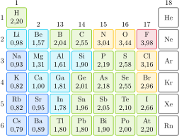
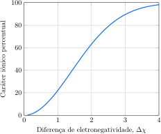

# As propriedades das ligações

As características de uma ligação covalente entre dois átomos se devem principalmente às propriedades desses átomos. Elas variam pouco com a natureza de outros átomos presentes na molécula. Isso permite predizer algumas características de uma ligação com razoável certeza conhecendo os dois átomos que a formam, independentemente dos outros átomos na molécula. Assim, desde que a ordem de ligação seja a mesma, o comprimento e a força de uma ligação $\ce{A-B}$ são aproximadamente os mesmos, independentemente da molécula em que estão. Por isso, é possível entender as propriedades de moléculas grandes, como, a replicação do DNA em nossas células e a transferência da informação genética, estudando as características das ligações $\ce{C=O}$ e $\ce{N-H}$ de compostos muito mais simples, como o formaldeído, $\ce{H2C=O}$, e a amônia, $\ce{NH3}$.

Outra questão importante é que as ligações iônicas e covalentes (Tópico 1D) são dois modelos extremos da ligação química. A maior parte das ligações reais tem caráter intermediário, parte iônica e parte covalente. A ligação covalente é um bom modelo para descrever as ligações entre não metais. Quando um metal e um não metal estão presentes em um composto simples, a ligação iônica é um bom modelo. Em muitos compostos, entretanto, as ligações parecem ter propriedades entre esses dois modelos extremos. É possível descrever essas ligações com mais precisão aperfeiçoando os dois modelos fundamentais?

## A energia de dissociação

A força de uma ligação química é medida por sua **energia de dissociação**, $D$, a energia necessária para separar completamente os átomos ligados. Em um gráfico da energia potencial de uma molécula diatômica em função da distância internuclear, a energia de dissociação é a diferença de energia entre o fundo do poço de potencial e a energia dos átomos separados (Figura 3). Quando uma ligação deste tipo se rompe, cada átomo fica com um dos elétrons da ligação. Um exemplo é:
$$
    \ce{ H-Cl(g) -> H^.(g) + Cl^.(g) }
$$
Uma energia de dissociação alta indica um poço de potencial profundo e, portanto, uma ligação forte, que exige muita energia para ser quebrada. A ligação mais forte conhecida entre dois átomos de não metais é a ligação tripla do monóxido de carbono, cuja energia de dissociação é $\pu{1062 kJ.mol-1}$. Uma das ligações mais fracas conhecidas é a de dois átomos de iodo, no iodo molecular, cuja energia de dissociação é somente $\pu{139 kJ.mol-1}$.

> A força de uma ligação entre dois átomos é medida por sua energia de dissociação: quanto maior é a energia de dissociação, mais forte é a ligação.

## A eletronegatividade

Uma única estrutura de Lewis é apenas a primeira etapa na formulação de uma descrição de uma molécula covalente. Esta descrição pode ser aperfeiçoada utilizando a ressonância, que permite combinar as contribuições alternativas. Todas as moléculas podem ser vistas como híbridos de ressonância de estruturas puramente covalentes e puramente iônicas, ainda que em grau limitado. Assim, a estrutura da molécula de $\ce{Cl2}$ pode ser descrita como:
$$
    \ce{ Cl^- Cl^+ <-> Cl-Cl <-> Cl^+ Cl^- }
$$
Neste caso, as estruturas iônicas (apenas um par de íons localizados, não um grupo numeroso deles) contribuem muito pouco para o híbrido de ressonância e podemos descrever a ligação como quase puramente covalente. Além disso, as duas estruturas iônicas têm a mesma energia e contribuem igualmente para o híbrido, e a carga média de cada átomo é zero. Entretanto, em uma molécula composta de elementos diferentes, como o HCl, a ressonância
$$
    \ce{ H^- Cl^+ <-> H-Cl <-> H^+ Cl^- }
$$
tem contribuições diferentes das duas estruturas iônicas. Como o átomo de cloro tem afinidade eletrônica maior do que o hidrogênio, a estrutura com uma carga negativa no átomo de $\ce{Cl}$, $\ce{H^+ Cl^-}$, contribui mais efetivamente do que $\ce{H^- Cl^+}$. Como resultado, existe uma pequena carga negativa residual no átomo de $\ce{Cl}$ e uma pequena carga positiva residual no átomo de $\ce{H}$.

As cargas líquidas nos átomos de $\ce{HCl}$, isto é, o resultado médio da ressonância, são chamadas de **cargas parciais** e são escritas como:
$$
    \ce{ ^{$\delta +$}H-Cl^{$\delta -$} }
$$
Uma ligação na qual existem cargas parciais diferentes de zero é chamada de **ligação covalente polar**. Todas as ligações entre átomos de elementos diferentes são, até certo ponto, polares. As ligações em moléculas e íons diatômicos homonucleares (formadas por um único elemento) não são polares porque, embora as estruturas iônicas contribuam de forma diferente, as cargas líquidas nos átomos são zero.

As cargas parciais nos dois átomos em uma ligação covalente polar formam um **dipolo elétrico**, isto é, uma carga parcial positiva ao lado de uma carga parcial negativa de mesmo módulo. Na convenção original, um dipolo é representado por uma seta que aponta para a carga parcial positiva:
$$
    \underset{ \ce{<-} }{ \ce{H-Cl} }
$$
Claramente, é preciso saber que convenção está sendo usada! Neste texto usamos a convenção moderna. O tamanho de um dipolo elétrico --- que é uma medida da magnitude das cargas parciais --- é chamado de **momento de dipolo elétrico**, $\mu$, em unidades denominadas **debye** ($\pu{D}$). O debye é definido de forma que uma carga negativa unitária (um elétron) separada por $\pu{100 pm}$ de uma carga unitária positiva (um próton) corresponde a um momento de dipolo $\pu{4,8 D}$. O momento de dipolo associado a uma ligação $\ce{Cl-H}$ é cerca de $\pu{1,1 D}$. Esse dipolo pode ser visto como o resultado de uma carga parcial de cerca de $\pu{23}\%$ de um elétron no átomo de $\ce{Cl}$ e uma carga positiva equivalente no átomo de $\ce{H}$.

:::info

### Unidades

A unidade SI de momento de dipolo é $\pu{1 C.m}$. É o momento de dipolo de uma carga de $\pu{1 C}$ separada de uma carga de $\pu{-1 C}$ por $\pu{1 m}$.
$$
    \pu{1 D} = \pu{3,3e-30 C.m}
$$

:::

Uma ligação covalente é polar se um átomo tem poder de atração do elétron maior do que o outro átomo, porque então o par de elétrons tem maior probabilidade de ser encontrado próximo ao primeiro. Em 1932, o químico norte-americano Linus Pauling propôs uma medida quantitativa desta capacidade de atração. O poder de atração dos elétrons exercido por um átomo que participa de uma ligação é chamado de **eletronegatividade**. As eletronegatividades são representadas por $\chi$. O átomo do elemento que tem a eletronegatividade mais alta tem maior poder de atrair elétrons e tende a afastá-los do átomo que tem a menor eletronegatividade. Pauling baseou sua escala nas energias de dissociação, $D$, das ligações $\ce{A-A}$, $\ce{B-B}$ e $\ce{A-B}$, medidas em elétron-volts. Ele definiu a diferença de eletronegatividade dos dois elementos $\ce{A}$ e $\ce{B}$ como
$$
    | \chi_{\ce{A}} - \chi_{\ce{B}} | 
        = \left\{ D_{\ce{A-B}} - \dfrac{1}{2}\left( D_{\ce{A-A}} + D_{\ce{B-B}}\right) \right\}^{1/2}
\tag{1}
$$
Os elementos com eletronegatividade baixa (como os metais do bloco s) muitas vezes são chamados de **eletropositivos**.

Um modo diferente de estabelecer uma escala de eletronegatividade foi desenvolvido, em 1934, por outro químico norte-americano, Robert Mulliken. Em sua abordagem, a eletronegatividade é a média entre a energia de ionização ($I$) e a afinidade eletrônica ($E_\mathrm{ea}$) do elemento (ambas expressas em elétron-volts):
$$
    \chi_{\ce{A}} = \dfrac{ I + E_\mathrm{ae} }{2}
\tag{2}
$$
A definição de Mulliken faz sentido porque um átomo doa um elétron com dificuldade se a energia de ionização é alta. Além disso, se a afinidade eletrônica do átomo é alta, então ligar um elétron a ele é energeticamente favorável. Os elementos que têm ambas as características perdem elétrons com dificuldade (no sentido de que a perda de elétrons envolve grande quantidade de energia) e tendem a ganhá-los (no sentido de que a energia é reduzida se tiverem sucesso), logo, são classificados como muito eletronegativos. De modo análogo, se a energia de ionização e a afinidade eletrônica são baixas, muito pouca energia é necessária para que o elemento ceda elétrons e ele tem pouca tendência a recebê-los, consequentemente, a eletronegatividade é baixa.

Como as energias de ionização e as afinidades eletrônicas são maiores no alto, à direita, da Tabela Periódica (perto do flúor, com a exceção dos gases nobres), não é surpreendente que nitrogênio, oxigênio, bromo, cloro e flúor sejam os elementos com as maiores eletronegatividades (Figura 1).

Quando a diferença em eletronegatividade entre os dois átomos em uma ligação é muito pequena, as cargas parciais também são pequenas. Quando a diferença de eletronegatividade aumenta, também crescem as cargas parciais. Se a diferença nas eletronegatividades for muito grande, um dos átomos pode ficar com a maior parte do par de elétrons, e a estrutura iônica correspondente contribui apreciavelmente para a ressonância. Como se apropriou da maior parte do par de elétrons compartilhado, o elemento muito eletronegativo lembra um ânion, e o outro, um cátion. Essas ligações têm **caráter iônico** considerável.

Não existe uma linha divisória clara entre as ligações covalentes e iônicas. Entretanto, uma regra útil diz que uma diferença de eletronegatividade da ordem de 2 unidades significa que o caráter iônico da ligação é tão alto que é melhor considerar a ligação como iônica (Figura 2). Para diferenças de eletronegatividade menores do que $\pu{1,5}$, a descrição da ligação como covalente é razoável. Por exemplo, as eletronegatividades do carbono e do oxigênio são $\pu{2,55}$ e $\pu{3,44}$, o que representa uma diferença de eletronegatividade igual a $\pu{0,89}$. Portanto, as ligações $\ce{C-O}$ devem ser consideradas covalentes polares. Contudo, há exceções a essas regras. Por exemplo, a eletronegatividade do magnésio é $\pu{1,31}$ e as ligações $\ce{Mg-Cl}$, com diferença de eletronegatividade de $\pu{1,85}$, são consideradas iônicas.

> A eletronegatividade é uma medida do poder de atração de um átomo sobre o par de elétrons de uma ligação. Uma ligação covalente polar é uma ligação entre dois átomos com cargas elétricas parciais provenientes da diferença de eletronegatividade. Cargas parciais dão origem a um momento de dipolo elétrico.

## A polarizabilidade

Considere a abordagem alternativa da ligação iônica e o modo como esta descrição pode ser aperfeiçoada. Todas as ligações iônicas têm algum caráter covalente. Para ver como o caráter covalente aparece, imagine um ânion monoatômico (como o $\ce{Cl^-}$) próximo a um cátion (como o $\ce{Na^+}$). Como as cargas positivas do cátion atraem os elétrons do ânion, a nuvem eletrônica esférica do ânion distorce-se na direção do cátion. Você pode interpretar essa distorção como uma tendência da densidade eletrônica da ligação de ocupar a região entre os núcleos, formando uma ligação covalente. Quanto maior é a distorção na nuvem de elétrons, maior é o caráter covalente da ligação.

Os átomos e íons com nuvens de elétrons que sofrem forte distorção são considerados muito polarizáveis. Pode-se esperar que um ânion seja muito polarizável se ele for volumoso, como o íon iodeto, $\ce{I^-}$. Em um ânion dessas proporções, o núcleo exerce controle muito pequeno sobre os elétrons mais externos porque a carga nuclear efetiva sentida pelos elétrons de valência é relativamente pequena (Tópico 1B). O resultado é que a nuvem eletrônica do ânion maior é distorcida com facilidade e o íon é muito polarizável. Os cátions, que têm menos elétrons do que os átomos originais, não são significativamente polarizáveis porque os elétrons que restam experimentam uma carga nuclear efetiva muito maior e, por essa razão, ficam mais fortemente presos.

Os átomos e íons capazes de provocar grandes distorções na nuvem eletrônica de seus vizinhos têm alto **poder de polarização**. Um cátion pode ter um alto poder de polarização se ele for pequeno e tiver carga elevada, como o cátion $\ce{Al^{3+}}$. Um raio pequeno significa que o centro de cargas de um cátion com carga elevada fica muito perto do ânion e pode exercer forte atração sobre seus elétrons. As ligações em compostos formados por um cátion pequeno e altamente carregado e um ânion volumoso e polarizável tendem a ter considerável caráter covalente.

Os cátions tornam-se menores, com carga maior e, portanto, com maior poder de polarização, da esquerda para a direita em um período. Assim, o $\ce{Be^{2+}}$ tem maior poder de polarização do que o $\ce{Li^+}$, e o $\ce{Mg^{2+}}$ tem maior poder de polarização do que o $\ce{Na^+}$. Por outro lado, os cátions ficam maiores e têm menor poder de polarização de cima para baixo em um grupo. Assim, o $\ce{Na^+}$ tem menor poder de polarização do que o $\ce{Li^+}$, e o $\ce{Mg^{2+}}$ tem menor poder de polarização do que o $\ce{Be^{2+}}$. Como o poder de polarização aumenta do $\ce{Li^+}$ para o $\ce{Be^{2+}}$, mas decresce do $\ce{Be^{2+}}$ para o $\ce{Mg^{2+}}$, os valores do poder de polarização dos vizinhos diagonais $\ce{Li^+}$ e $\ce{Mg^{2+}}$ devem ser semelhantes. Tais semelhanças nas propriedades de outros vizinhos nas diagonais da Tabela Periódica não são incomuns e fazem parte das relações diagonais na Tabela Periódica apresentadas no Tópico 1C.

> A ligação química dos compostos formados por cátions e ânions muito polarizáveis tem forte caráter covalente.

## O comprimento de ligação

O comprimento de ligação é a distância entre os centros de dois átomos em ligação covalente. Ele corresponde à distância internuclear no mínimo de energia potencial dos dois átomos (Figura 3). Os comprimentos de ligação afetam o volume total e a forma de uma molécula. A transmissão da informação hereditária no DNA, por exemplo, depende dos comprimentos de ligação porque os dois ramos da hélice dupla devem encaixar-se como peças de um quebra-cabeças. Os comprimentos de ligação são também cruciais para a ação das enzimas, porque somente uma molécula com o volume e a forma corretos pode se ajustar ao sítio ativo da molécula da enzima (Tópico 3I). Os comprimentos de ligação são determinados experimentalmente por espectroscopia ou difração de raios X.

Como mostra a Tabela 1, os comprimentos das ligações entre elementos do Grupo 2 estão, em geral, entre $\pu{100 pm}$ e $\pu{150 pm}$. As ligações entre átomos pesados tendem a ser mais longas do que as de átomos leves porque os átomos pesados têm raios maiores. Entre os mesmos dois elementos, as ligações múltiplas são mais curtas do que as ligações simples porque os elétrons de ligação adicionais atraem os núcleos mais fortemente e os aproximam: compare os comprimentos das várias ligações carbono-carbono da Tabela 1. O efeito da ressonância sobre as ligações também fica claro: o comprimento das ligações carbono-carbono do benzeno é intermediário entre os das ligações simples e duplas de uma estrutura de Kekulé (porém mais próximo do valor da ligação dupla).

:::displaytable

#### Comprimentos de ligação médios e experimentais

| **Ligação**        | $r/\pu{pm}$ | **Molécula** | $r/\pu{pm}$ |
| :----------------- | ----------: | :----------- | ----------: |
| $\ce{C-H}$         |  $\pu{109}$ | $\ce{H2}$    |   $\pu{74}$ |
| $\ce{C-C}$         |  $\pu{154}$ | $\ce{N2}$    |  $\pu{110}$ |
| $\ce{C=C}$         |  $\pu{134}$ | $\ce{O2}$    |  $\pu{121}$ |
| $\ce{C\bond{~-}C}$ |  $\pu{139}$ | $\ce{F2}$    |  $\pu{142}$ |
| $\ce{C#H}$         |  $\pu{120}$ | $\ce{Cl2}$   |  $\pu{199}$ |
| $\ce{C-O}$         |  $\pu{143}$ | $\ce{Br2}$   |  $\pu{228}$ |
| $\ce{C=O}$         |  $\pu{112}$ | $\ce{I2}$    |  $\pu{268}$ |
| $\ce{O-H}$         |   $\pu{96}$ |              |             |
| $\ce{N-H}$         |  $\pu{101}$ |              |             |
| $\ce{N-O}$         |  $\pu{140}$ |              |             |
| $\ce{N=O}$         |  $\pu{120}$ |              |             |

:::

Algumas correlações úteis podem ser obtidas com esses dados. Por exemplo, nas ligações entre o mesmo par de átomos, *a ligação mais curta é mais forte*. Assim, uma ligação tripla $\ce{C#C}$ é mais forte e mais curta do que uma ligação dupla $\ce{C=C}$. O mesmo acontece com uma ligação dupla $\ce{C=O}$, que é mais forte e mais curta do que uma ligação simples $\ce{C-O}$.

Assim como as energias de ligação são essencialmente transferíveis entre moléculas, os raios atômicos são semelhantes, independentemente das moléculas formadas por esses átomos. Cada átomo tem uma contribuição característica, chamada de **raio covalente**, para o comprimento de uma ligação. O comprimento de ligação é aproximadamente a soma dos raios covalentes dos dois átomos envolvidos. O comprimento da ligação $\ce{O-H}$ do etanol, por exemplo, é a soma dos raios covalentes de $\ce{O}$ e de $\ce{H}$, $\pu{37 pm} + \pu{66 pm} = \pu{103 pm}$. Contudo, o valor exato depende da ordem da ligação: o raio covalente de um átomo em uma ligação múltipla é menor do que em uma ligação simples do mesmo átomo

Os raios covalentes decrescem, tipicamente, da esquerda para a direita em um período. O motivo é o mesmo observado para os raios atômicos (Tópico 1C): o aumento da carga nuclear efetiva puxa os elétrons e torna o átomo mais compacto. Como os raios atômicos, os raios covalentes crescem de cima para baixo em um grupo porque, em períodos sucessivos, os elétrons de valência ocupam camadas cada vez mais distantes do núcleo e são blindados mais efetivamente pelo caroço de elétrons.

> O raio covalente de um átomo é a contribuição que ele dá para o comprimento de uma ligação covalente. Os raios covalentes devem ser somados quando se deseja estimar os comprimentos de ligação em moléculas.

# As contribuições para a entalpia

Um aspecto da ciência que você encontrará com frequência é que uma compreensão mais profunda da matéria vem da percepção de como as propriedades físicas resultam do comportamento individual de átomos e moléculas. A termodinâmica trata das propriedades da matéria vista a olho nu, mas os seus conhecimentos sobre elas aumentam consideravelmente quando você entender a origem destas propriedades em termos atômicos.

## A formação de íons

O Tópico 1C apresenta os conceitos de energia de ionização, $I$, e afinidade eletrônica, $E_\mathrm{ae}$. Estas duas propriedades, bastante relacionadas, são usadas na termodinâmica. A **entalpia de ionização**, $\Delta H_\mathrm{ion}$, é a variação da entalpia padrão por mol de átomos por conta da perda de um elétron. Para o elemento $\ce{X}$:
$$
    \ce{ X(g) -> X^+(g) + e^-(g) } \quad \Delta H_\mathrm{ion}
$$
A entalpia do ganho de elétrons, $\Delta H_\mathrm{ge}$, é a quantidade análoga para o ganho de elétrons.
$$
    \ce{ X(g) + e^-(g)-> X^-(g)  } \quad \Delta H_\mathrm{ge}
$$
Observe que a entalpia do ganho de elétrons e a afinidade eletrônica (como definida no Tópico 1C) têm sinais opostos. Logo, a entalpia do ganho de elétrons é negativa se o ganho de elétrons libera energia (como em qualquer processo exotérmico).

As entalpias de ionização e de ganho de elétrons são numericamente muito semelhantes (exceto pelos sinais opostos entre $E_\mathrm{ae}$ e $\Delta H_\mathrm{ge}$) às variações correspondentes na energia --- elas diferem em alguns quilojoules por mol --- e, ao menos que seja necessária alta precisão, normalmente podemos usar sos valores de energia. As tendências dos valores acompanham as da energia de ionização e da afinidade eletrônica, como mostrado no Tópico 1C. Logo, os átomos dos elementos alcalinos têm entalpias de ionização baixas (positivas), ao passo que os átomos dos halogênios têm valores fortemente negativos de entalpia de ganho de elétrons.

:::info

### Nota

As energias nas figuras do Tópico 1C podem ser vistas como variações na energia interna em $T = 0$, e se referem à variação da energia quando apenas o estado fundamental é ocupado inicialmente. Com $T > 0$, as populações se espalham entre os estados disponíveis, e a variação na energia interna considera essa condição. Na prática, a diferença numérica entre os dois parâmetros é pequena, porque praticamente toda a população está no estado fundamental em temperaturas normais.

:::

> As entalpias de ionização e de ganho de elétrons são as versões termodinâmicas da energia de ionização e da afinidade eletrônica.

## O ciclo de Born-Haber

Para um determinado sólido, a diferença de entalpia molar entre o sólido e um gás de íons muito separados é chamada de entalpia de rede do sólido, $\Delta H_\mathrm{rede}$:
$$
    \ce{ XY(s) -> X^+(g) + Y^-(g) } \quad \Delta H_\mathrm{rede}
$$
A entalpia de rede pode ser identificada com o calor necessário para vaporizar o sólido em um gás de íons muito espaçados sob pressão constante. Quanto maior for a entalpia de rede, mais calor é necessário. A discussão no Tópico 2A referiu-se à energia de rede. A entalpia de rede difere da energia de rede por alguns quilojoules por mol e pode ser interpretada de modo semelhante.

A entalpia de rede de um sólido normalmente não pode ser medida de modo direto. Porém, como a entalpia é uma função de estado, ela pode ser obtida indiretamente pela combinação de medidas. O procedimento usa um **ciclo de Born-Haber**, um caminho fechado de etapas, uma das quais é a formação da rede de um sólido a partir de um gás de íons. No ciclo, os elementos são separados em átomos que são ionizados. O gás de íons gerado forma o sólido iônico. Por fim, os elementos são formados novamente a partir do sólido iônico. Só a entalpia da rede, o negativo da entalpia da formação do sólido iônico a partir do gás de íons, é desconhecida. A soma das variações de entalpia no ciclo de Born-Haber completo é zero, porque a entalpia do sistema deve ser a mesma no início e no fim do ciclo.

:::example

### Cálculo da entalpia de rede usando o ciclo de Born-Haber

Considere as reações:
$$
\begin{aligned}
    \ce{ K(s) &-> K(g) } && \Delta H_\mathrm{sub}^\circ = \pu{+89 kJ//mol} \\
    \ce{ Cl2(g) &-> 2 Cl(g) } && \Delta H_\mathrm{B}^\circ = \pu{+242 kJ//mol} \\
    \ce{ K(g) &-> K^+(g) + e^- } && \Delta H_\mathrm{ion}^\circ = \pu{+418 kJ//mol} \\
    \ce{ Cl(g) + e^-(g) &-> Cl^-(g) } && \Delta H_\mathrm{ge}^\circ = \pu{-349 kJ//mol} \\
    \ce{ K(s) + 1/2 Cl2(g) &-> KCl(s) } && \Delta H_\mathrm{f}^\circ = \pu{-437 kJ//mol}
\end{aligned}
$$

**Calcule** a entalpia de rede do cloreto de potássio.

#### Escreva a reação de interesse como uma composição das reações fornecidas.

$$
\begin{aligned}
    \ce{ \cancel{\ce{K(s)}} &-> \cancel{\ce{K(g)}} } \\
    \ce{ \cancel{\ce{1/2 Cl2(g)}} &-> \cancel{\ce{Cl(g)}} } \\
    \ce{ \cancel{\ce{K(g)}} &-> K^+(g) + \cancel{\ce{e^-}} } \\
    \ce{ \cancel{\ce{Cl(g)}} + \cancel{\ce{e^-(g)}} &-> Cl^-(g) } \\
    \ce{ KCl(s) &-> \cancel{\ce{K(s)}} + \cancel{\ce{1/2 Cl2(g)}} } \\[1ex]
    \hline \\[-2ex]
    \ce{ KCl(s) &-> K^+(g) + Cl^-(g) }
\end{aligned}
$$

#### Calcule a entalpia de rede.

$$
\begin{aligned}
    \Delta H^\circ_\mathrm{rede}
        &= \Big\{ (\pu{89}) + \dfrac{1}{2}(\pu{242}) + (\pu{418}) + (\pu{-349}) - (\pu{-437}) \Big\} \, \pu{kJ//mol} \\
        &= \boxed{ \pu{+716 kJ.mol-1} }
\end{aligned}
$$

:::

> A energia de interação entre os íons em um sólido é dada pela entalpia de rede, que pode ser determinada com um ciclo de Born‑Haber.

## As entalpias de ligação

A energia de uma ligação química é medida pela entalpia de ligação, $\Delta H_\mathrm{L}$, a diferença entre as entalpias padrão molares de uma molécula $\ce{X-Y}$ (por exemplo, $\ce{H3C-OH}$) e de seus fragmentos $\ce{X}$ e $\ce{Y}$ (como $\ce{^.CH3}$ e $\ce{^.OH}$) na fase gás:
$$
    \ce{ X-Y(g) -> X(g) + Y(g) } \quad \Delta H_\mathrm{L}
$$
Enquanto a entalpia de rede é igual ao calor necessário (sob pressão constante) para separar um mol de uma substância iônica em seus íons na fase gás, a entalpia de ligação é igual ao calor necessário para quebrar um tipo específico de ligação sob pressão constante. Por exemplo, a entalpia de ligação de $\ce{H2}$ é obtida da equação termoquímica
$$
    \ce{ H2(g) -> H(g) + H(g) } \quad \Delta H_{\mathrm{L}, \ce{H2}} = \pu{+436 kJ//mol}
$$
Todas as entalpias de ligação são positivas, porque é necessário fornecer calor para quebrar uma ligação. Em outras palavras:

- A quebra de uma ligação é sempre endotérmica e a formação de uma ligação é sempre exotérmica.

A Tabela 2 lista as entalpias de ligação de algumas moléculas diatômicas.

:::displaytable

#### Entalpias de ligação de moléculas diatômicas

| **Molécula** | $\Delta H_\mathrm{L}/\pu{kJ//mol}$ | **Molécula** | $\Delta H_\mathrm{L}/\pu{kJ//mol}$ |
| :----------- | ---------------------------------: | :----------- | ---------------------------------: |
| $\ce{H2}$    |                         $\pu{436}$ | $\ce{O2}$    |                         $\pu{496}$ |
| $\ce{N2}$    |                         $\pu{944}$ | $\ce{CO}$    |                        $\pu{1074}$ |
| $\ce{F2}$    |                         $\pu{158}$ | $\ce{HF}$    |                         $\pu{565}$ |
| $\ce{Cl2}$   |                         $\pu{242}$ | $\ce{HCl}$   |                         $\pu{431}$ |
| $\ce{Br2}$   |                         $\pu{193}$ | $\ce{HBr}$   |                         $\pu{366}$ |
| $\ce{I2}$    |                         $\pu{151}$ | $\ce{HI}$    |                         $\pu{299}$ |

:::

Em uma molécula poliatômica, todos os átomos da molécula exercem atração --- por meio de suas eletronegatividades --- sobre todos os elétrons da molécula. Como resultado, a energia de ligação em um determinado par de átomos varia pouco de um composto a outro. Por exemplo, a entalpia de ligação de uma ligação $\ce{O-H}$ na água ($\pu{492 kJ.mol-1}$), é diferente da mesma ligação no metanol, $\ce{CH3OH}$, ($\pu{437 kJ.mol-1}$). Entretanto, essas variações de entalpia de ligação não são muito grandes, de modo que a entalpia de ligação média, que também é representada por $\Delta H_\mathrm{L}$, serve como guia para a energia de uma ligação de qualquer molécula que contém a ligação (Tabela 3).

:::displaytable

#### Entalpias de ligação médias

| **Ligação**        | $\Delta H_\mathrm{L}/\pu{kJ//mol}$ | **Ligação** | $\Delta H_\mathrm{L}/\pu{kJ//mol}$ |
| :----------------- | ---------------------------------: | :---------- | ---------------------------------: |
| $\ce{C-H}$         |                         $\pu{412}$ | $\ce{C-I}$  |                         $\pu{238}$ |
| $\ce{C-C}$         |                         $\pu{348}$ | $\ce{N-H}$  |                         $\pu{388}$ |
| $\ce{C=C}$         |                         $\pu{612}$ | $\ce{N-N}$  |                         $\pu{163}$ |
| $\ce{C\bond{~-}C}$ |                         $\pu{518}$ | $\ce{N=N}$  |                         $\pu{409}$ |
| $\ce{C#C}$         |                         $\pu{837}$ | $\ce{N-O}$  |                         $\pu{210}$ |
| $\ce{C-O}$         |                         $\pu{360}$ | $\ce{N=O}$  |                         $\pu{630}$ |
| $\ce{C=O}$         |                         $\pu{743}$ | $\ce{N-F}$  |                         $\pu{270}$ |
| $\ce{C-N}$         |                         $\pu{305}$ | $\ce{N-Cl}$ |                         $\pu{200}$ |
| $\ce{C-F}$         |                         $\pu{484}$ | $\ce{O-H}$  |                         $\pu{463}$ |
| $\ce{C-Cl}$        |                         $\pu{338}$ | $\ce{O-O}$  |                         $\pu{157}$ |
| $\ce{C-Br}$        |                         $\pu{276}$ |             |                                    |

:::

As tendências das energias de ligação mostradas nas tabelas são explicadas, em parte, pelas estruturas de Lewis das moléculas. Vejamos, por exemplo, as moléculas diatômicas de nitrogênio, oxigênio e flúor. Observe a diminuição da energia de ligação quando a multiplicidade da ligação decresce, de 3, em $\ce{N2}$, para 1, em $\ce{F2}$. A ligação tripla do nitrogênio é a origem de sua inércia química. Uma ligação múltipla é, sem dúvida, sempre muito mais forte do que uma ligação simples, porque mais elétrons unem os átomos. Uma ligação tripla entre dois átomos é sempre mais forte do que uma ligação dupla entre os mesmos átomos, e uma ligação dupla é sempre mais forte do que uma ligação simples. Entretanto, uma ligação dupla entre dois átomos de carbono não  duas vezes mais forte do que uma ligação simples, e uma ligação tripla é muito menos forte do que três vezes uma ligação simples. Pode-se ver, por exemplo, que a entalpia de ligação média de uma ligação dupla $\ce{C=C}$ é $\pu{612 kJ.mol-1}$, mas são necessários $\pu{696 kJ.mol-1}$ para quebrar duas ligações simples $\ce{C-C}$. Da mesma forma, a energia média de dissociação de uma ligação tripla $\ce{C#C}$ é $\pu{837 kJ.mol-1}$, mas consomem-se $\pu{1044 kJ.mol-1}$ para quebrar três ligações simples $\ce{C-C}$. A origem dessas diferenças está, em parte, nas repulsões entre os pares de elétrons de uma ligação múltipla que fazem cada par envolvido não ser tão efetivo na ligação como um par de elétrons de uma ligação simples.

Os valores da Tabela 3 mostram como a ressonância afeta as energias de ligação. Por exemplo, a energia de uma ligação carbono-carbono do benzeno é intermediária entre as das ligações simples e duplas. A ressonância distribui o caráter de ligação múltipla por todas as ligações e, como resultado, as ligações simples são reforçadas, e as ligações duplas, enfraquecidas. O efeito total geral é a estabilização da molécula.

A presença de pares isolados pode influenciar as energias das ligações. Os pares isolados repelem-se e, se eles estão em átomos vizinhos, a repulsão pode enfraquecer a ligação. A repulsão entre pares isolados ajuda a explicar por que a ligação em $\ce{F2}$ é mais fraca do que em $\ce{H2}$: esta última molécula não tem pares isolados.

As variações de energia de ligação correlacionam-se com as variações de raios atômicos. Se os núcleos dos átomos ligados não podem se aproximar do par que fica entre eles, a ligação dos dois átomos é fraca. Por exemplo, as energias de ligação dos halogenetos de hidrogênio decrescem de $\ce{HF}$ para $\ce{HI}$, como se vê na Tabela 2. A energia da ligação entre o hidrogênio e um elemento do Grupo 14 também decresce no grupo de cima para baixo. Esse enfraquecimento da ligação correlaciona-se com a diminuição da estabilidade dos hidretos de cima para baixo no grupo. O metano, $\ce{CH4}$, pode ser mantido indefinidamente no ar na temperatura normal. O silano, $\ce{SiH4}$, se inflama em contato com o ar. O estanano, $\ce{SnH4}$, decompõe-se em estanho e hidrogênio. O plumbano, $\ce{PbH4}$, nunca foi preparado, exceto, talvez, em quantidades mínimas (traços).

As entalpias de reação podem ser estimadas usando as entalpias médias de ligação para determinar a energia total necessária para quebrar as ligações dos reagentes e formar as ligações dos produtos. Na prática, só as ligações que sofrem alterações são levadas em conta. Como as entalpias de ligação referem-se às substâncias na fase gás, todas elas devem ser gases ou ser convertidas à fase gás.

As energias relativas das ligações são importantes para a compreensão de como a energia é usada nos organismos para fazer funcionar nossos cérebros e músculos. Por exemplo, o trifosfato de adenosina, ATP, é encontrado em todas as células vivas. A parte trifosfato dessa molécula é uma cadeia de três grupos fosfato. Um dos grupos fosfato é removido em uma reação com água. A ligação $\ce{P-O}$ do ATP requer apenas $\pu{276 kJ.mo-1}$ para quebrar, e a nova ligação $\ce{P-O}$ formada em $\ce{H2PO4^-}$ libera $\pu{350 kJ.mol-1}$ quando se forma. O resultado é que a conversão de ATP a difosfato de adenosina, ADP, na reação
$$
    \ce{ ATP(aq) + H2O(l) -> ADP(aq) + H2PO4^-(aq) }
$$
pode liberar energia que é usada para a realização de determinados processos nas células.

Muito relacionada à energia de uma ligação é sua rigidez (a resistência ao alongamento e à compressão), com as ligações fortes sendo normalmente mais rígidas do que as ligações fracas. A rigidez das ligações é medida por espectroscopia de infravermelho (IV) e é usada para identificar compostos.

:::example

### Cálculo da entalpia de reação usando as entalpias de ligação médias

O gás propeno reage com bromo líquido para formar 1,2-dibromopropano líquido:
$$
    \ce{ CH3CH=CH2(g) + Br2(l) -> CH3CHBrCH2Br(l) }
$$
As entalpias de vaporização do 1,2-dibromopropano e do bromo são $\pu{36 kJ.mol-1}$ e $\pu{30 kJ.mol-1}$, respectivamente.

**Calcule** a entalpia da reação.

|                                    | $\ce{C=C}$ | $\ce{Br-Br}$ | $\ce{C-C}$ | $\ce{C-Br}$ |
| :--------------------------------- | ---------: | -----------: | ---------: | ----------: |
| $\Delta H_\mathrm{L}/\pu{kJ//mol}$ | $\pu{612}$ |   $\pu{193}$ | $\pu{348}$ |  $\pu{276}$ |

#### Calcule a entalpia de dissociação das ligações quebradas nos reagentes.

Ligações quebradas: $1\times\ce{C=C} + 1\times\ce{Br-Br}$.
$$
    \Delta H_1^\circ
        = \Big\{ (\pu{612}) + (\pu{193}) \Big\}\pu{kJ//mol} 
        = \pu{+805 kJ.mol-1}
$$

#### Calcule a entalpia de formação das ligações formadas nos produtos.

Ligações formadas: $1\times\ce{C-C} + 2\times\ce{C-Br}$.
$$
    \Delta H_2^\circ
        = -\Big\{ (\pu{612}) + 2(\pu{276}) \Big\}\pu{kJ//mol} 
        = \pu{-900 kJ.mol-1}
$$

#### Calcule a entalpia de reação.

De $\Delta H_\mathrm{r}^\circ = \Delta H_1^\circ + \Delta H_2^\circ + \Delta H_{\mathrm{vap}, \ce{Br2}}^\circ  - \Delta H_{\mathrm{vap}, \ce{C3H6Br2}}^\circ$
$$
\begin{aligned}
    \Delta H^\circ_\mathrm{r}
        &= -\Big\{ (\pu{805}) + (\pu{-900}) + (\pu{30}) - (\pu{36}) \Big\}\pu{kJ//mol} \\
        &= \boxed{ \pu{-101 kJ.mol-1} }
\end{aligned}
$$

:::

> A entalpia de ligação média é a média da variação de entalpia que acompanha a dissociação de um determinado tipo de ligação.
